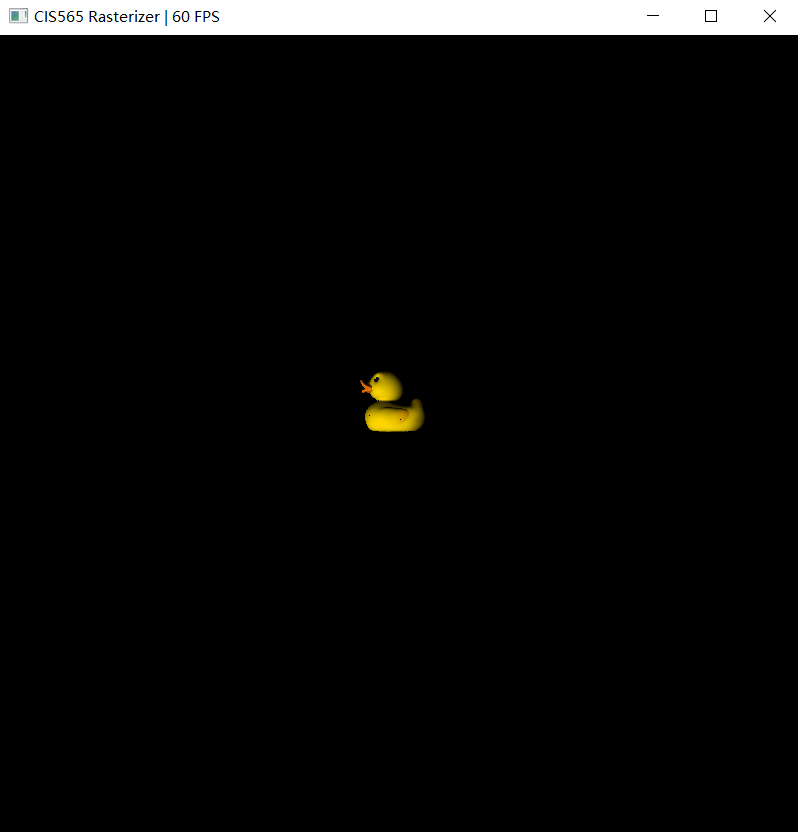
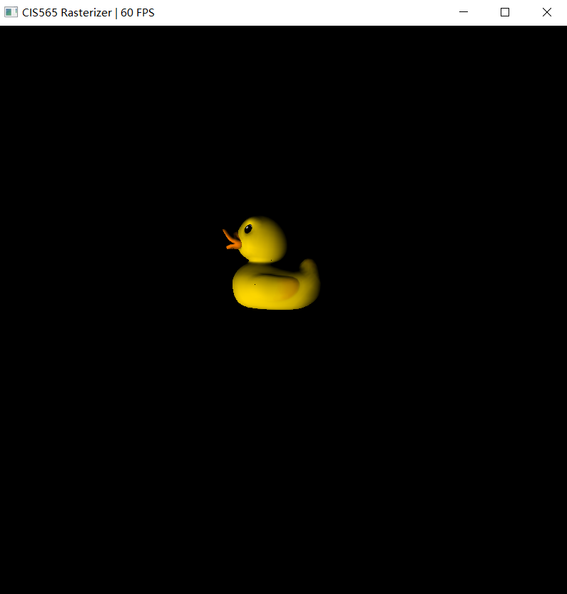
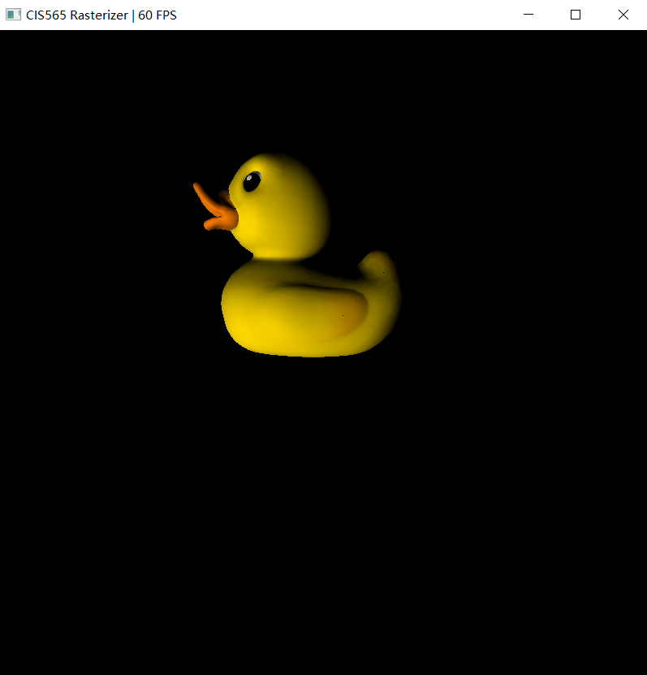
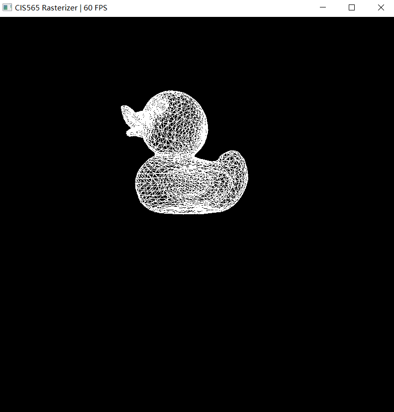
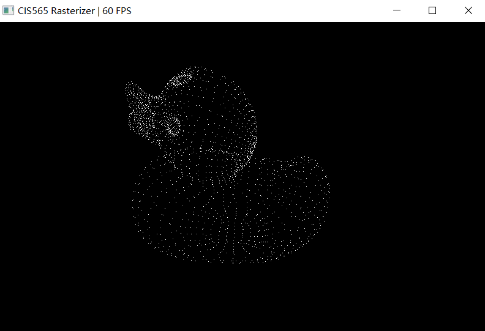
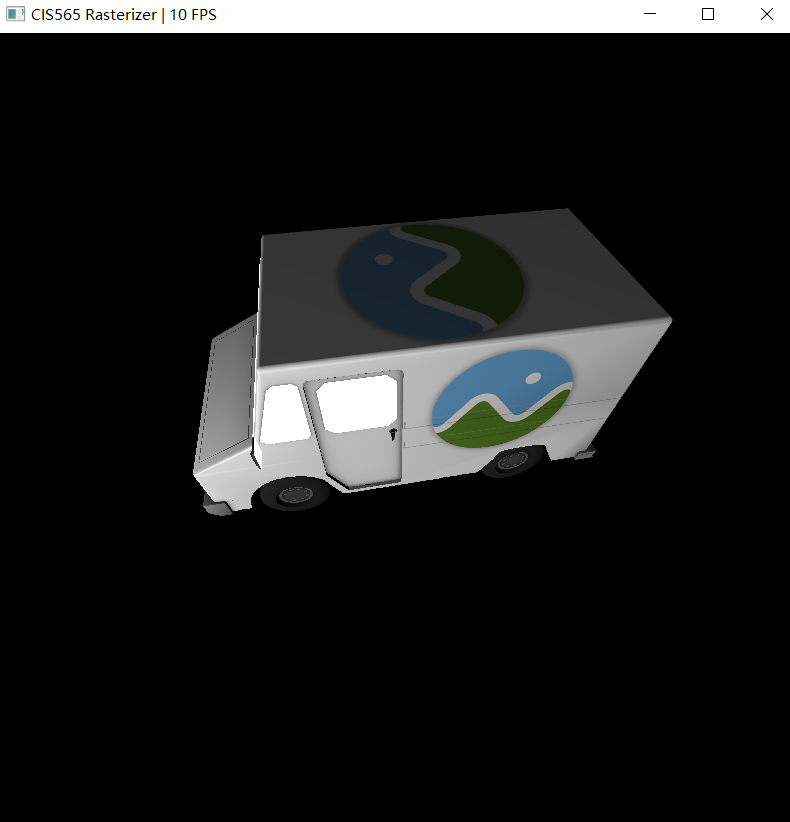

CUDA Rasterizer
===============

[CLICK ME FOR INSTRUCTION OF THIS PROJECT](./INSTRUCTION.md)

**University of Pennsylvania, CIS 565: GPU Programming and Architecture, Project 4**

* Xinyu Lin
[Linkedin](https://www.linkedin.com/in/xinyu-lin-138352125/)
* Tested on: Windows 10, Intel(R) Core(TM) i7-6700HQ CPU@2.60GHz, 16GB, GTX960M(Private Computer)

# Features:
- **Basic features**
  - Basic Lambert shading:
  - Line rasterization mode
  - Point rasterization mode
  - UV texture mapping with perspective correct texture coordinates
  
Far | Mid | Near
------|------|------
 |  | 
 60Fps | 60Fps | 60Fps
# Line rasterization mode
  
  - 60FPS
  
# Point rasterization mode
  
  - 60FPS

# UV texture mapping with perspective correct texture coordinates
  
  - 10FPS

### Credits

* [tinygltfloader](https://github.com/syoyo/tinygltfloader) by [@soyoyo](https://github.com/syoyo)
* [glTF Sample Models](https://github.com/KhronosGroup/glTF/blob/master/sampleModels/README.md)
CUDA Path Tracer
================
