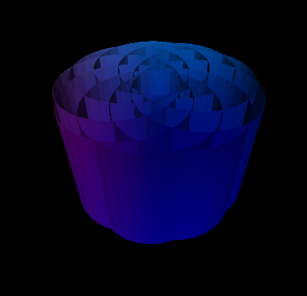
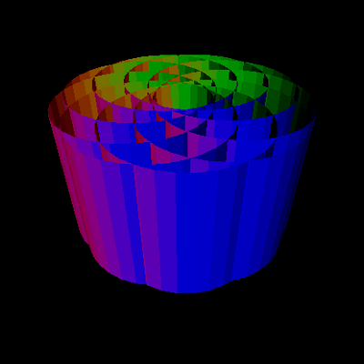
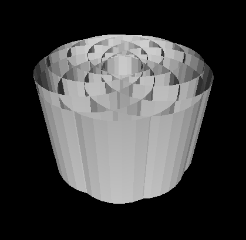
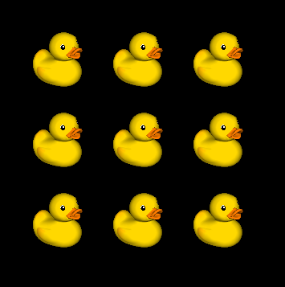
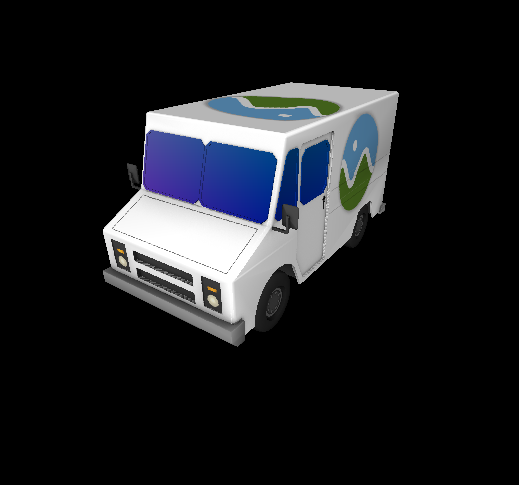
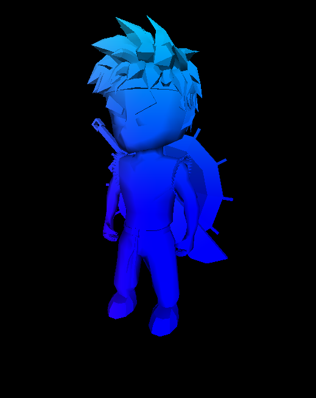
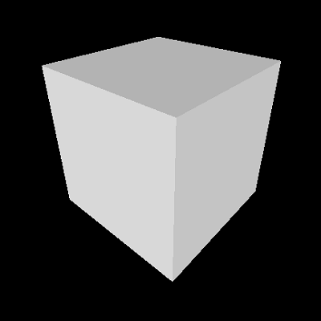
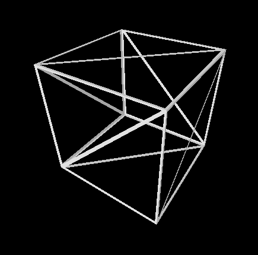
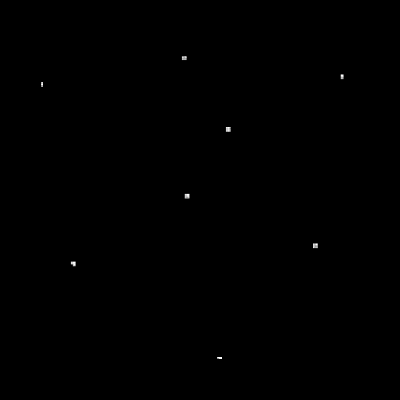
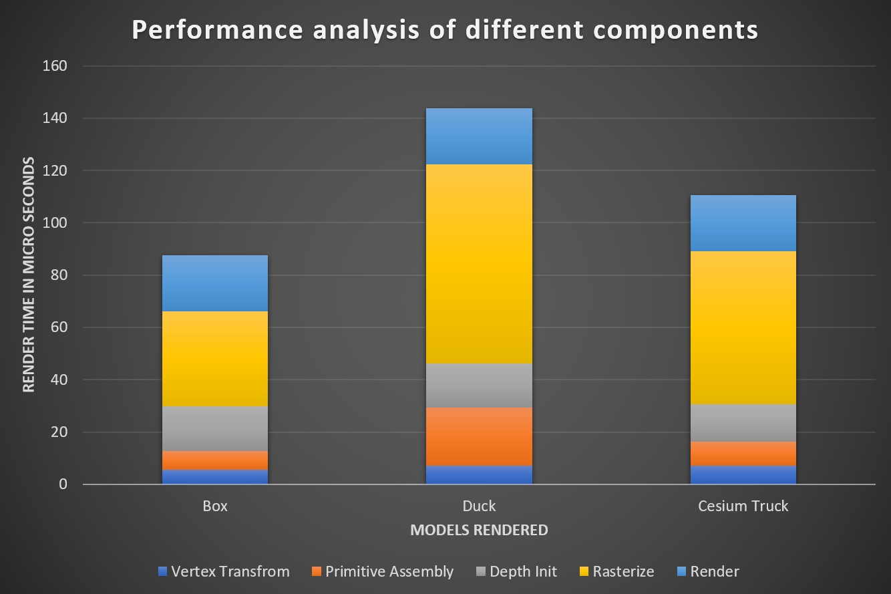

CUDA Rasterizer
===============

**University of Pennsylvania, CIS 565: GPU Programming and Architecture**

**Anantha Srinivas**
[LinkedIn](https://www.linkedin.com/in/anantha-srinivas-00198958/), [Twitter](https://twitter.com/an2tha)

**Tested on:**
* Windows 10, i7-8700 @ 3.20GHz 16GB, GTX 1080 8097MB (Personal)
* Built for Visual Studio 2017 using the v140 toolkit

# Introduction

 

This implementation of Rasterization is done on CUDA and split into these five important steps:

* Vertex Transform and Assembly - This acts as a vertex shader and transforms the input vertices from world space to NDC space and then into screen space. Screen space transformation is done because we are deadling with pixels on the framebuffer.

* Primitive Assembly - From the list of vertices, we construct primitives containing 1/2/3 vertices depending upon the geometry(point, line or triangle). To select the vertices, index buffer is used.

* Core Rasterization - This performs a scan of pixel in the small rectangular boundary around each primitive. Then we check if the pixel lies inside or outside this primitive and set initialize the fragment accordingly. We also perform a depth check to ensure that the fragment is valid.

* Pixel Shading - This acts as the pixel shader, where we calculate the color from the fragment.

* Updating frame buffer - The frame buffer for each frame is updated to the screen. Normally in modern graphics API, there might be two or more framebuffer, so that while one is updating other one is shown. Also, if any super sampling is used here, the framebuffer is downscaled accordingly.

# Features

The current version of the rasterizer supprots the following features:

* Vertex Shading and primitive assembly with depth testing

| Color  | Normal | Depth |
| ------------- | ------------- |  ------------- |
|  |   |  

Simple, basic implementations of vertex transform, normal calculation and transform and depth checking.

* Instancing

This is implemented similar to modern graphics APIs. Each vertex shader of each instance has the same pointer to the input vertex buffer. The output vertices are modified here based on the instance ID by offsetting in screen space.

* Texture Mapping (2D) with bilinear filtering

Similar to vertex and normals, texture coordinates is calculated per pixel. It is then corrected to account for depth by performing perspective correction.

In bilinear filtering, we sample not only the current texture coordinate but also the neighbours. This is then accompanied by mixing all the sampled points in a ratio determined by how far off is the texture coordinate from the sampled point.

* SuperSample Antialiasing

| No SSAA |  SSAA 2 |
| ------------- | ------------- |
|  |   | 

SuperSample AntiAliasing is the most basic implementation of AA. Here, the framebuffer size is incrased by the level of AA. We perform all the calculation with this enlarged framebuffer and then downscale it when updating to screen. It can be expensive both computationally and memory.

* Color interpolation between points on a primitive

Interpolating color between vertices of a primitive using the bary centric coordinates.

* Points and Lines

| Triangles  | Lines | Points |
| ------------- | ------------- |  ------------- |
|   |   |

# Performance Analysis

**Testing Conditions**
* Launched in Release Mode
* NVIDIA V-Sync turned off
* Run with NSight Profiler

**General Analysis**
* From the performance graph is is fairly evident that the most expensive component of the rasterizer (in terms of time) is the raterizer. This is because of the fact that for each primitive, we need to scan pixel by pixel (computationally O(n^2)). The obvious way to minimize this would be to have some hardware implementations for some of the sub-functions. Other than that, we could load up the framebuffer and depth buffer into shared memory. Although not implemented, this could potentially speed up the kernel in magnitudes of 10X. 
* We also see that the Render step, where we perform pixel shading is fairly same across all models. This is because the kernel is launched per pixel (number which remains same across all models). The calculation inside this pixel is fairly short. 

# Build Command

`cmake .. -G "Visual Studio 15 2017 Win64" -DCUDA_TOOLKIT_ROOT_DIR="C:/Program Files/NVIDIA GPU Computing Toolkit/CUDA/v9.2" -T v140,cuda=9.2`

### Credits

* [tinygltfloader](https://github.com/syoyo/tinygltfloader) by [@soyoyo](https://github.com/syoyo)
* [glTF Sample Models](https://github.com/KhronosGroup/glTF/blob/master/sampleModels/README.md)
