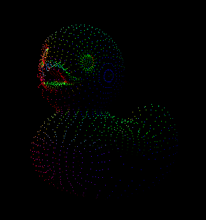
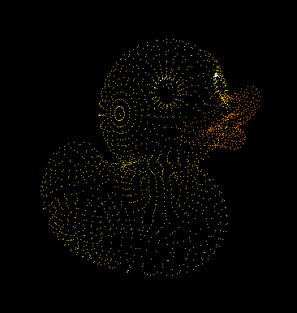
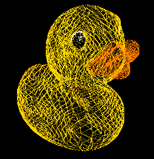
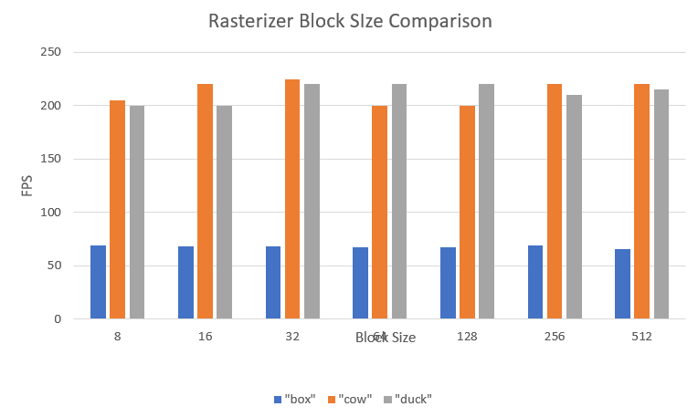

CUDA Rasterizer
===============

[CLICK ME FOR INSTRUCTIONS FOR THIS PROJECT](./INSTRUCTION.md)

**University of Pennsylvania, CIS 565: GPU Programming and Architecture, Project 4**

* Angelina Risi
  * [LinkedIn](www.linkedin.com/in/angelina-risi)
  * [Twitter](https://twitter.com/Angelina_Risi)
* Tested on: Windows 10, i7-6700HQ @ 2.60GHz 8GB, GTX 960M 4096MB (Personal Laptop)
  
  

  
## Features  
  
### Primitive Rasterization  
  
The current code supports triangles, lines, and points. Additionally, you can toggle wireframe mode and point cloud mode for triangles using the respective defined tokens at the beginning of rasterize.cu. Triangles and lines use perspective-correct interpolation to determine attributes of the overlapping fragments (see "Perspective-Correct Texture Mapping"). All supported modes still support textures and "paint normals" mode (using the interpolated normal as the color instead). By default, the fragment color is set to white.    
  
*Point Cloud:*  
  

  
*Wireframe:*  
  
  
  
  
The performance impact from the extra primitive support would be negligible for the current single primitive mode scenes tested, but in a complicated scene there would be branching. Currently each thread handles a primitive (which has its own performance tradeoffs for primitive size in screenspace), but if, for example, the different primitive types were not sorted to be contiguous in memory and a scene contained many of each type, there would be divergent branching frequently in warps, in essence cutting performance in the rasterization step in half or worse depending on how many different types and the run time of each (with triangles being slowest and points fastest). However, the current tradeoff is being able to draw these shapes at all, and optimizations could be made, such as the sorting previously mentioned.  
  
  
### Texturing
  
  
  
Currently texture sampling for fragment colors is supported.  
  
#### Bilinear Texture Filtering  
  
Since vertices are given specific UV coordinates on the texture in floating point values normalized 0 to 1, there are bound to be issues with texture scaling and aliasing effects. Bilinear filtering blurs the target texel with its neighbors, smoothing the drawn texture, using linear interpolation. The coefficient used for interpolating in this case is the difference between the integer and float values of the texel index. The code design was actually based off the [Wikipedia page](https://en.wikipedia.org/wiki/Bilinear_filtering) and handles edge cases by wrapping the texture.  
The performance impact is extra index computations and memory access. The current implementation has branching for wrapping, which may be improved using a modulo instead for wrapping and other code optimizations, and must access and weight four texels as opposed to just one. At minimum, one would expect about a factor of four performance hit in the texture sampling funtion.
  
#### Perspective-Correct Texture Mapping
  
If you only compute the fragment attributes using the original vertex attributes and barycentric weights, you get "alline" interpolation. The problem with this method is most clearly seen in textures when perspective is used, and results in the texturing of neighboring triangles appearing "disjoint" with one another. To fix this, a perspective adjustment was applied by calculating the perspective-correct depth "w" and multiplying each contribution by this factor divided by the vertex z position for that attribute. In code:  
  
```cpp
// "bary" is the barycentric weights, and "tri" stores the vertex positions
float w = 1.0f / ((bary.x / tri[0].z) + (bary.y / tri[1].z) + (bary.z / tri[2].z));

fragBuf[f_idx].texcoord0 = w * (  (p.v[0].texcoord0 * bary.x / tri[0].z) 
                                 + (p.v[1].texcoord0 * bary.y / tri[1].z) 
                                 + (p.v[2].texcoord0 * bary.z / tri[2].z));
```
  
The result is reduced unwanted distortion on attributes due to distortion (the same formula can be used on normals, colors, etc). A comparison between affine (first image) and corrected (second image) textering is seen below for a checkerboard texture: 
  
   
  
The second image also has bilinear filtering. While the pattern does not look perfect, probably due to rounding errors, it is singnificantly improved from the affine case.  
  
The performance is not expected to suffer much from this feature, but while this part is compute light, it still requires several global memory accesses. The current implementation also has to pass the texture information to each vertex, and then to each fragment, which compounds the problem of memory use and access. Perhaps if there was an implementation grouping fragments by material or texture, and only passing the constant data (non-uv attributes for the texture) once for the group of fragments, it could improve performance. One could also make the assumption those fragments would appear grouped near each other in screen space if sharing a texture, so there is less worry of random access slowdown from this method as well.  
  
  
### Depth Buffer  
  
Both a integer depth buffer and an integer mutex buffer are stored with one entry per fragment. This simple implementation uses the mutex to force access to the depth buffer, and then to the fragment buffer, as a critical section. While this will affect the reasterizer speed, sometimes significantly, it avoids any race conditions caused by multiple primitives overlapping the same pixel coordinate. Currently it only has integer precision, so z-fighting for close objects may not be completely avoided. Part of the rasterizer code has been reproduced below. The relevant part is the "do while" loop that creates a critical section preventing access to the current fragment index by all other threads by using an atomic function to lock the address.
  
```cpp
inside = isBarycentricCoordInBounds(bary);

float z_float = getZAtCoordinate(bary, tri);
if (z_float < 0 || z_float > 1) continue;
int z = z_float * INT_MAX;

bool isSet = false;

if (inside) {
    isSet = false;
    do {
        isSet = (atomicCAS(mutex + f_idx, 0, 1) == 0);
        if (isSet) {
            // Critical section
            if (z < depth[f_idx]) {
                depth[f_idx] = z;
                fragBuf[f_idx] = f_true;
            }
        }
        if (isSet) {
            mutex[f_idx] = 0;
        }
    } while (!isSet);
}
```
  
However, by forcing serialization of memory access, we force a loss of performance. In a dense scene with many overlapping primitives, we can expect severe framerate drops since we lose some of the advantage of parallelism. This is necessary for accurately rendering a scene with depth and avoiding any race conditions from the overlapping objects. The only optimization that comes to mind is comparing with the z-buffer first to avoid locking and then not needing it, and then comparing again in the critical section to avoid race conditions. Perhaps even shared memory can be used to pre-load the entire z-buffer to speed up access for dense scenes.  
  
  
## Performance Analysis  
  
### Rasterizer Block Size  
  
After taking a rough estimate of the framerate during runtime for three different gltf files under different rasterizer block size conditions, I determined that with the current implementation, the block size has little to no effect on the framerate in most cases. In the cases where there are many triangles and each take little screen space, there is some changes due to thoroughput, and higher overall framerate.  
  

  
### Coloring and Motion  
  
Since the block size had little effect, I was curious about the effect of other factors, such as rendering of the normals versus textures and whether moving the scene around had significant impact.
  
  
### Credits

* [tinygltfloader](https://github.com/syoyo/tinygltfloader) by [@soyoyo](https://github.com/syoyo)
* [glTF Sample Models](https://github.com/KhronosGroup/glTF/blob/master/sampleModels/README.md)
