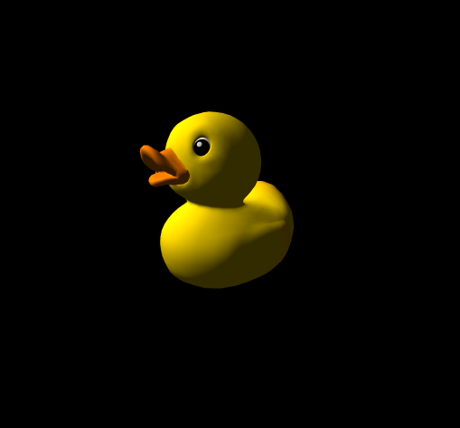
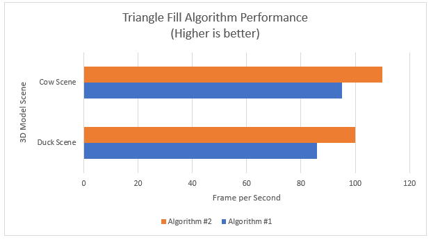
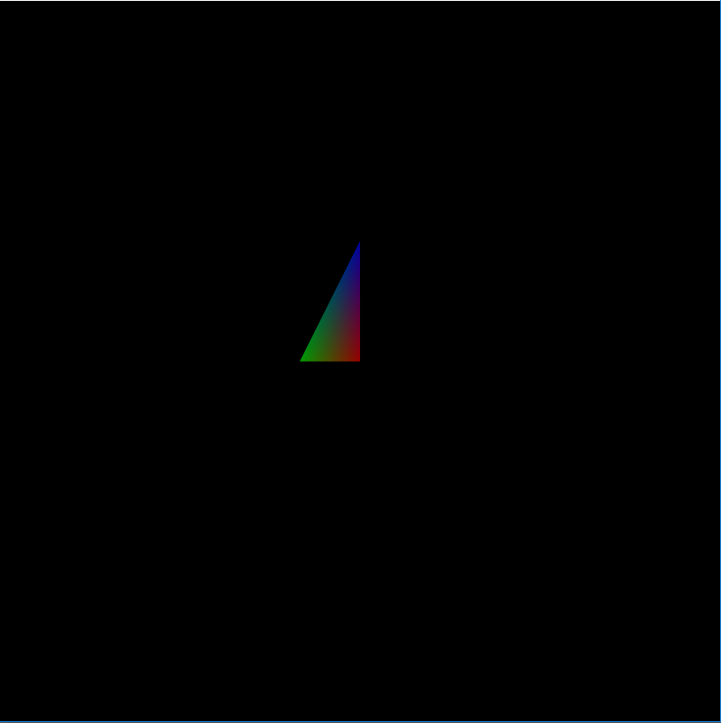
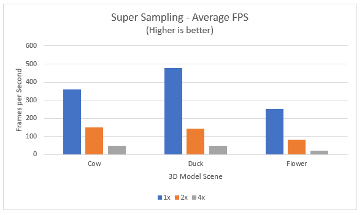
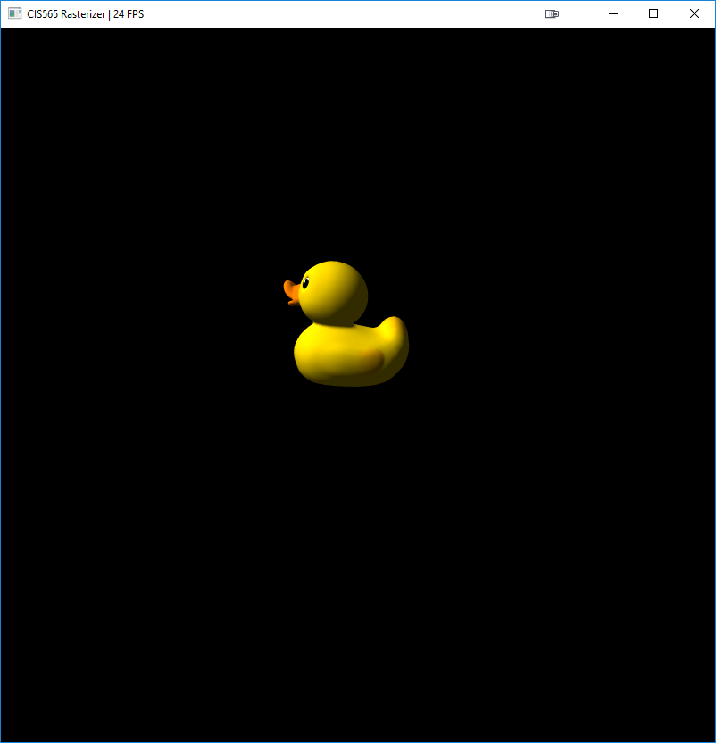

CUDA Rasterizer
===============

**University of Pennsylvania, CIS 565: GPU Programming and Architecture,
Project 3 - CUDA Path Tracer**

* Vasu Mahesh
  * [LinkedIn](http://linkedin.com/in/vasumahesh)
  * [Code Blog](http://www.codeplaysleep.com)




### Algorithm performance

```
Algorithm 1:

Go through every Y in AABB of Triangle:
  Go through every X in AABB of Triangle:
    if inside Triangle:
      Shade Pixel

// -----

Algorithm 2:

Go through every Y in AABB of Triangle:
  Find the range of X to fill for the triangle by intersecting the 3 line segments

  Go through every X in range of Triangle:
    Shade Pixel
```




### Perspective Correct Color interpolation

Correct Barycentric Interpolation




### Texture Sampling

Implemented basic texture sampling


### Anti-aliasing

Implemented super sampled AA




| With AA | No AA |
|:-----:|:-------:|
|| |

### Credits

* [tinygltfloader](https://github.com/syoyo/tinygltfloader) by [@soyoyo](https://github.com/syoyo)
* [glTF Sample Models](https://github.com/KhronosGroup/glTF/blob/master/sampleModels/README.md)
