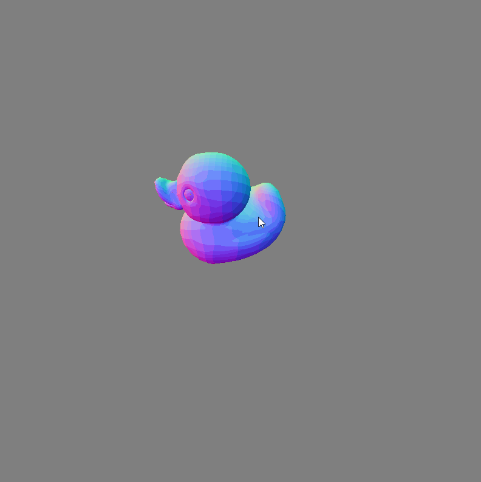
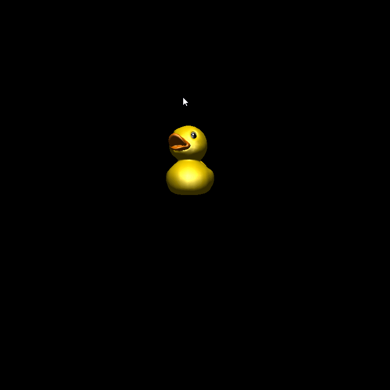
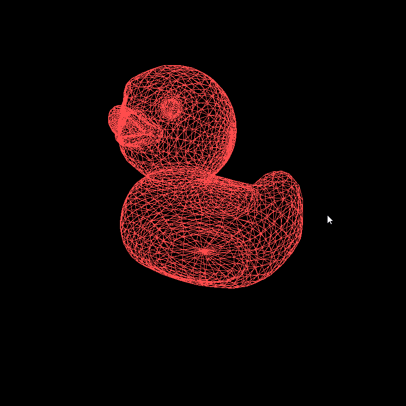
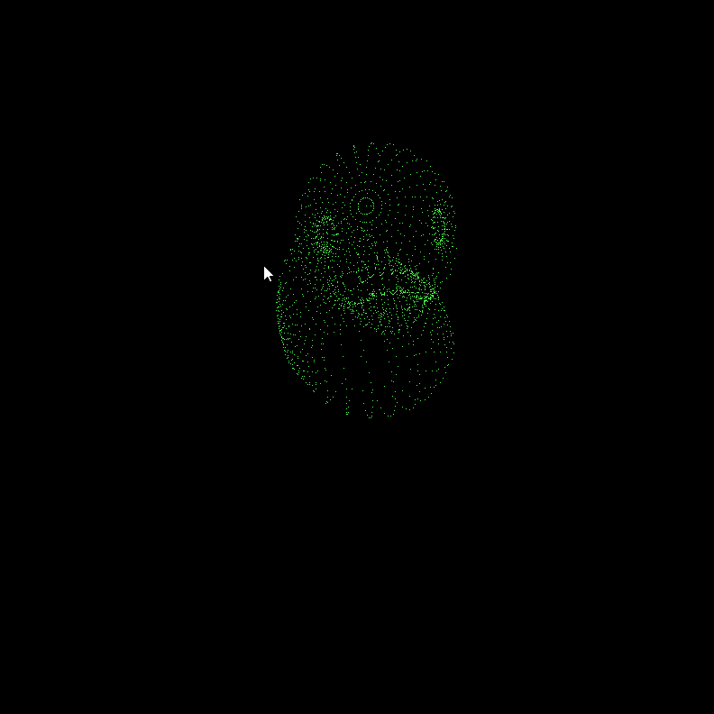
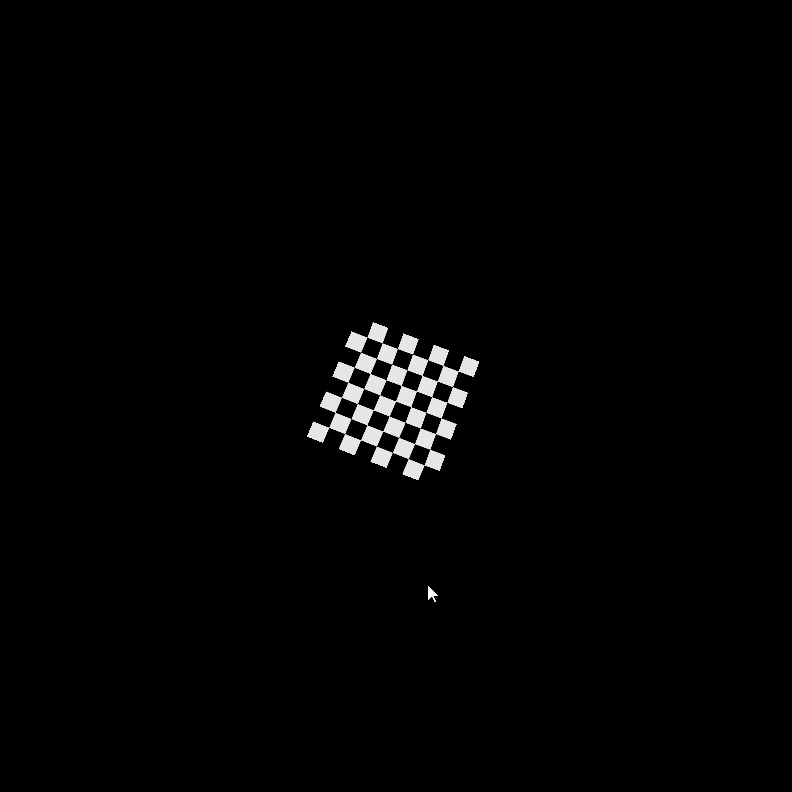
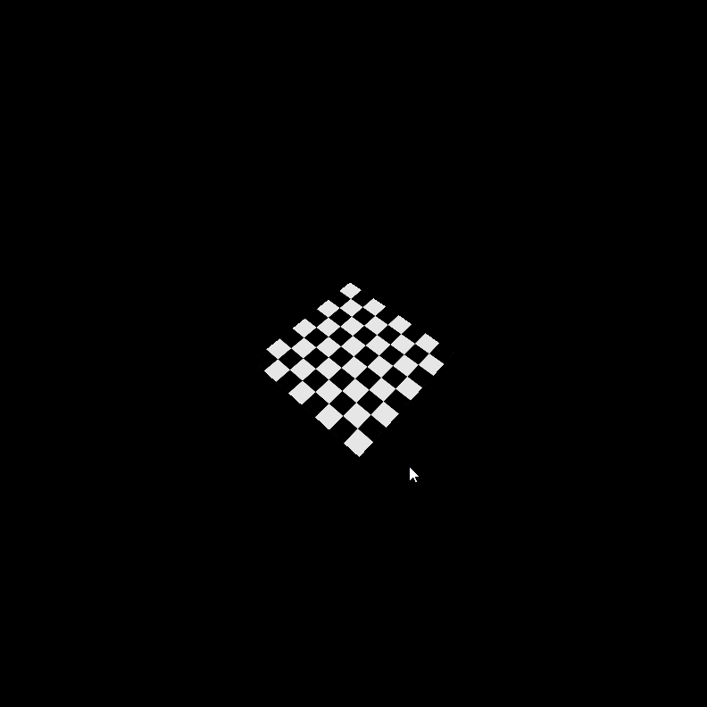
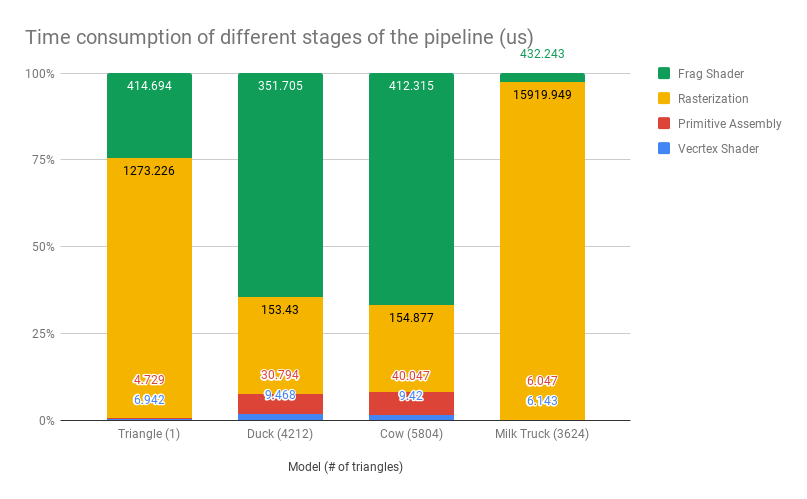
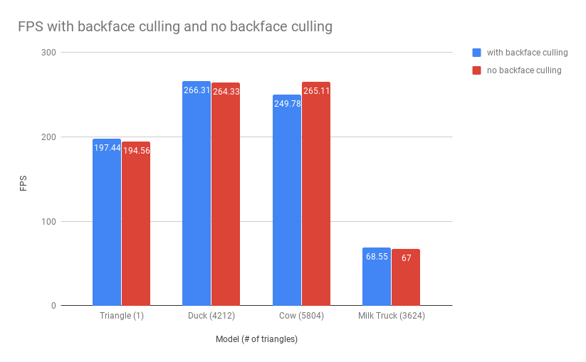

CUDA Rasterizer
===============

[CLICK ME FOR INSTRUCTION OF THIS PROJECT](./INSTRUCTION.md)

**University of Pennsylvania, CIS 565: GPU Programming and Architecture, Project 4**

* Zichuan Yu
  * [LinkedIn](https://www.linkedin.com/in/zichuan-yu/), [Behance](https://www.behance.net/zainyu717ebcc)
* Tested on: Windows 10.0.17134 Build 17134, i7-4710 @ 2.50GHz 16GB, GTX 980m 4096MB GDDR5

### Features

- Basic features
- Line and point rendering
- UV texture mapping with bilinear texture filtering and perspective correct texture coordinates.

### Results

#### Basics

||||
|-|-|-|
|Albedo|Normal|Lambert + Blinn-phong|

#### Line and point rendering

|||
|-|-|
|Line|Point|

#### Perspective correct UV and bilinear texture 

|||
|-|-|
|Incorrect UV|Correct UV|

### Performance Analysis

#### Time spent in each stage

To give guarantee enough operations for each step, all the features are turned on.

We can clearly see that the more space an onject took the window, the more time is spent on rasterization. Rasterization in our implementation is of heavy work.

#### Performance impact of backface culling

As we can see, there's no significant improvement after we add backface culling (even drawbacks). This indicate that in our naive implementation of backface culling (mainly the backface detection part) has more overhead than contribution in these models.

### Credits

* [tinygltfloader](https://github.com/syoyo/tinygltfloader) by [@soyoyo](https://github.com/syoyo)
* [glTF Sample Models](https://github.com/KhronosGroup/glTF/blob/master/sampleModels/README.md)
* [ssloy/tinyrenderer](https://github.com/ssloy/tinyrenderer/)
* [scratchapixel-Interpolation](https://www.scratchapixel.com/lessons/mathematics-physics-for-computer-graphics/interpolation/bilinear-filterig)
