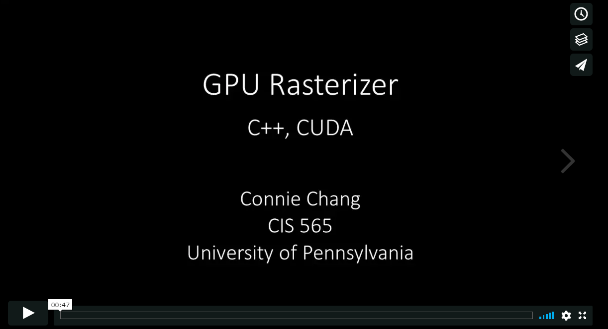
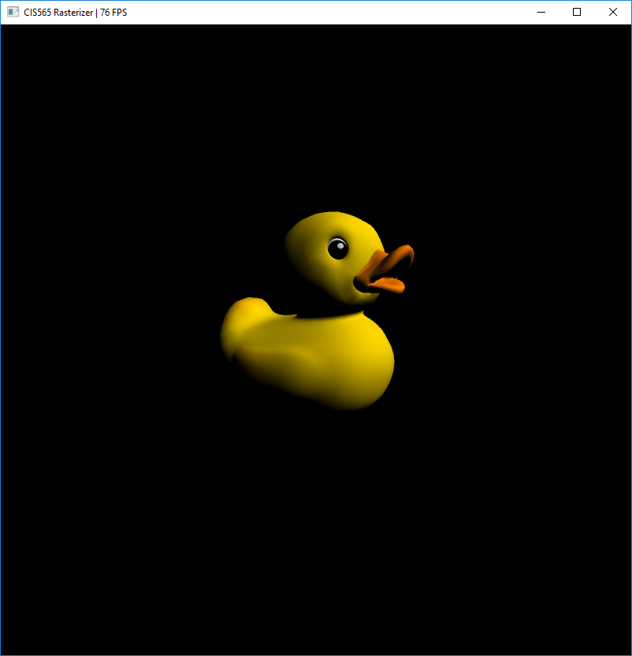
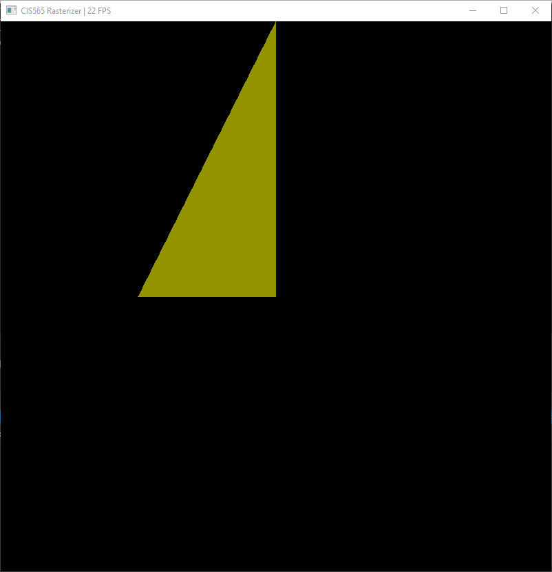
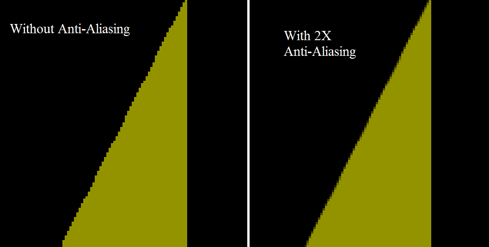
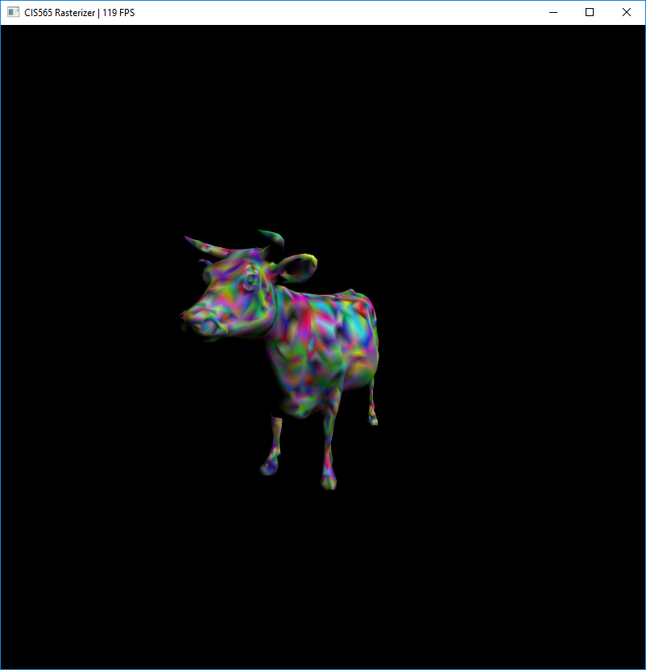
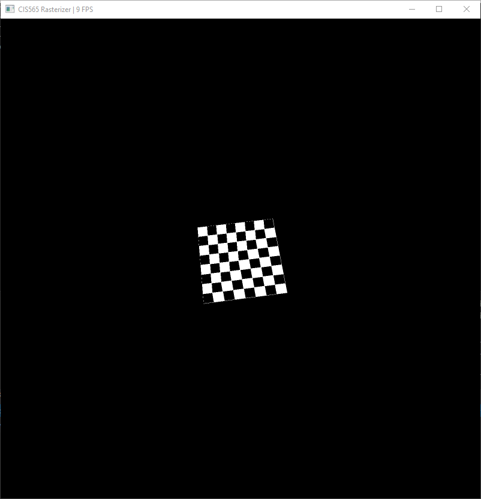
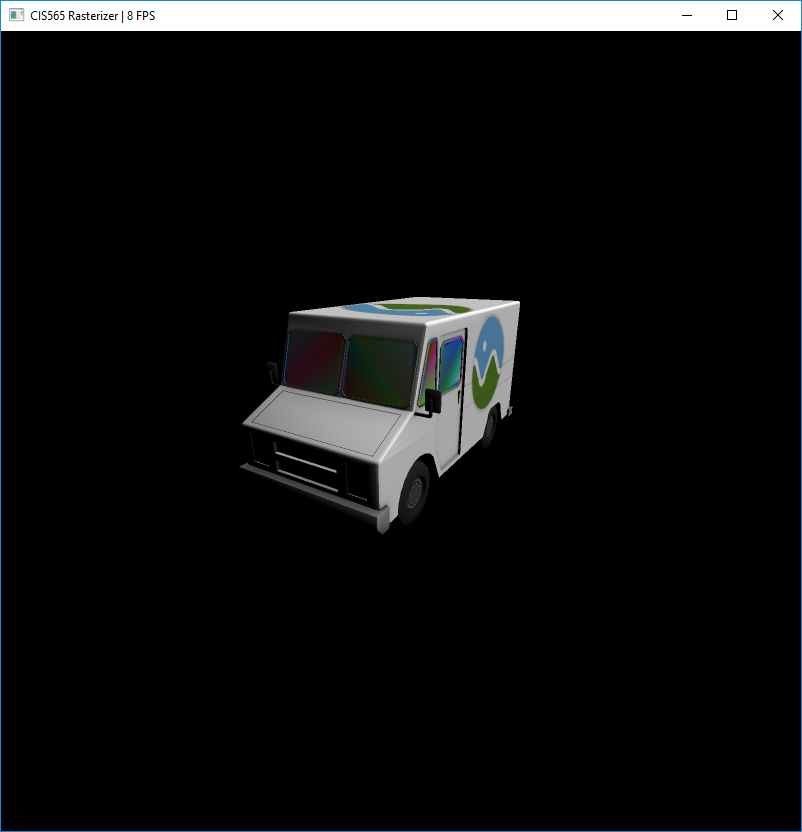
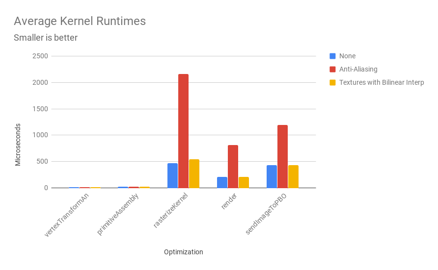
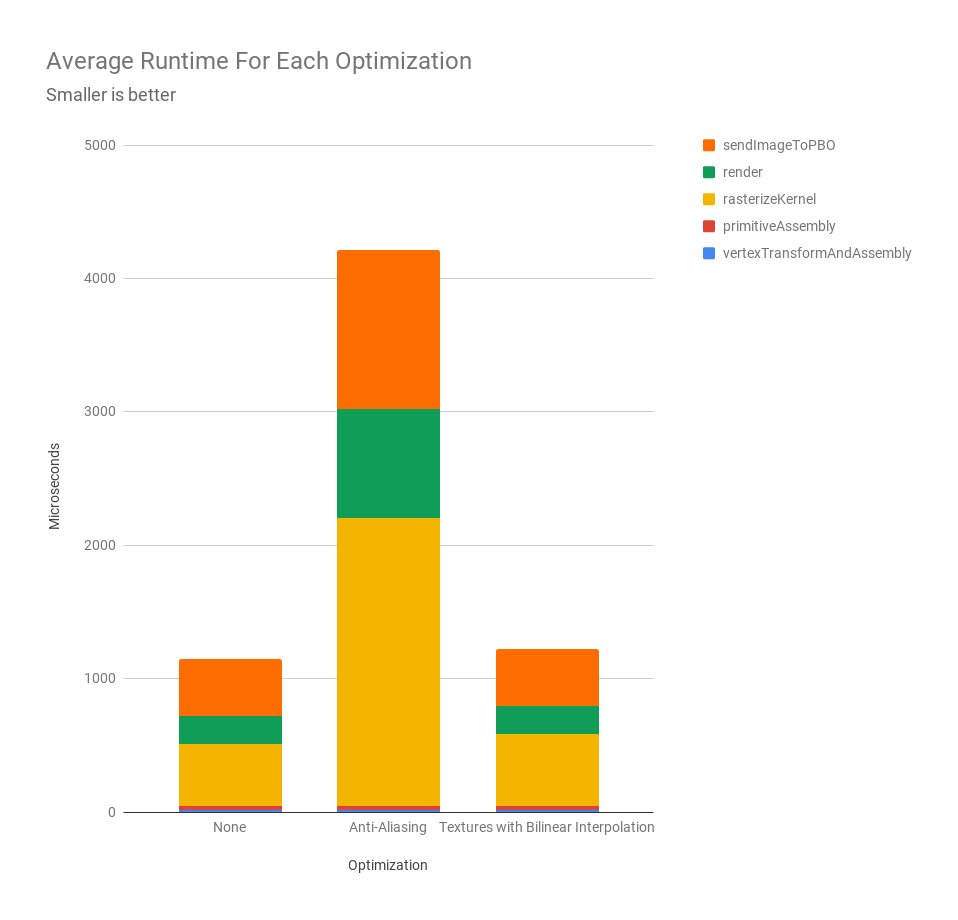

CUDA Rasterizer
===============

**University of Pennsylvania, CIS 565: GPU Programming and Architecture, Project 4**

## Scanline Rasterizer with CUDA on the GPU
### Connie Chang
  * [LinkedIn](https://www.linkedin.com/in/conniechang44), [Demo Reel](https://www.vimeo.com/ConChang/DemoReel)
* Tested on: Windows 10, Intel Xeon CPU E5-1630 v4 @ 3.70 GHz, GTX 1070 8GB (SIG Lab)

  
A render of a duck with a diffuse texture

## Introduction
Rasterization is a rendering technique that is faster than path tracing, but is not physically-based. A scanline rasterizer loops through every piece of geometry in the scene, and checks if it overlaps with a pixel. The geometry that is closest to the camera provides the color for that pixel. The technique is used widely in video games due to its speed.  

For this project, I implemented most of the graphics pipeline for a rasterizer using CUDA. The steps I coded were the vertex shader, rasterization, depth testing, and fragment shader. Depending on the step, a thread could represent a vertex, a primitive, or a pixel. The meat of the functionality is contained within the rasterizeKernel, which handles both rasterization and depth testing. To prevent race conditions during depth testing, a mutex is created for each pixel. The mutex locks the pixel's depth value if a thread is writing to it, preventing overlapping reads and writes that could lead to incorrect renders.

## Features
- Supersampling Anti-aliasing
- Color interpolation
- Textures with bilinear interpolation

## Anti-aliasing

Without Anti-Aliasing             |  With Anti-Aliasing
:-------------------------:|:-------------------------:
  |  

Images without and with 2x anti-aliasing  

Supersampling anti-aliasing was implemented to improve the visual result. The implementation is typical, rendering the image at a larger resolution before shrinking it down to the desired image side. It was tested with 2x anti-aliasing with each dimension of the image doubled. The results are shown below.  

  
Zoomed in comparison without and with anti-aliasing  

## Color interpolation
  
A render of a cow with randomly assigned colors  

If a primitive does not have a texture assigned to it, the rasterizer gives each vertex a random color. When calculating the color of a fragment, it uses perspective correct interpolation to interpolate a color from the three vertices. The results are shown in the cow above.  

## Textures and bilinear interpolation
  
A checkerboard texture using bilinear interpolation  

Texturing was implemented by using perspective correct interpolation to interpolate UV coordinates. However, using the texture color at the corresponding UV may not be accurate because pixels are discrete while UV coordinates are not. Therefore, a bilinear interpolation is performed using the surrounding pixels. The result is shown in the checkerboard above and the truck below.  

  
A truck with Cesium textures  

## Performance Analysis
All analysis was gathered using the duck scene.  

Most kernels run within a reasonable time. The bulk of the logic is in the rasterize kernel, so naturally it takes the longest. Unsurprisingly, anti-aliasing uses significantly more time for rasterize and render because it is creating an image that is four times larger. sendImageToPBO also takes longer for anti-aliasing because it needs to compress the larger image into a small one.  

  
The average runtime of each kernel for different features  

The graph below shows the same information in a stacked graph. From here, we see that texture calculation is barely slower than the without textures. This shows that textures with bilinear interpolation are a good addition to a rasterizer because it provides a huge visual improvement without much overhead.  

  
The average runtime of each feature  

In addition, a comparison was done for different numbers of primitives. The following FPS data was captured for the default positions of each scene. The rasterizer performs best for the duck, which also has the largest number of primitives. This occurs because the rasterization step is done with a primitive for each thread. Therefore, more threads are processing the render. On the other hand, the triangle only has a single thread running because it only contains one primitive. If the user zooms in too much on the triangle such that the triangle covers over half the screen, FPS can easily drop to 1 since it's a single thread coloring half the screen.  

  
FPS for different objects with different numbers of primitives

### Credits

* Emily Vo for helping debug texture colors
* [tinygltfloader](https://github.com/syoyo/tinygltfloader) by [@soyoyo](https://github.com/syoyo)
* [glTF Sample Models](https://github.com/KhronosGroup/glTF/blob/master/sampleModels/README.md)
