CUDA Rasterizer
===============

[CLICK ME FOR INSTRUCTION OF THIS PROJECT](./INSTRUCTION.md)

**University of Pennsylvania, CIS 565: GPU Programming and Architecture, Project 4**

* Yichen Shou
  * [LinkedIn](https://www.linkedin.com/in/yichen-shou-68023455/), [personal website](http://www.yichenshou.com/)
* Tested on: Windows 10, i7-2600KU @ 3.40GHz 16GB RAM, NVIDIA GeForce GTX 660Ti 8GB (Personal Desktop)

## Project Overview

This project implements a rasterizer on the GPU using OpenGL and CUDA. Various steps of the graphics pipeline, such as Vertex Assembly, Primitive Assembly, Rasterization and Fragment shading, uses the GPU to speed up efficiency. 

Diffuse Cow                |  Cow with Normals
:-------------------------:|:-------------------------:
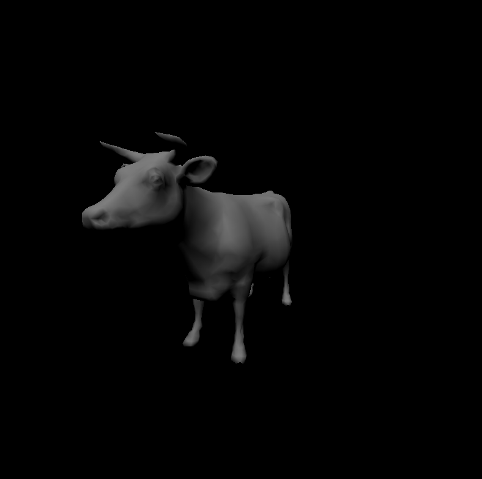  |  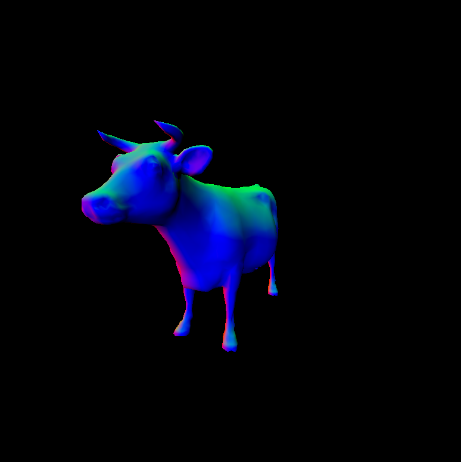

Diffuse Cube               |  Cube with Normals
:-------------------------:|:-------------------------:
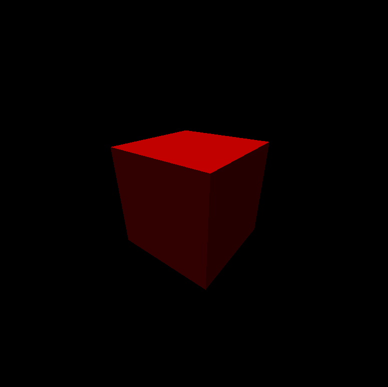  |  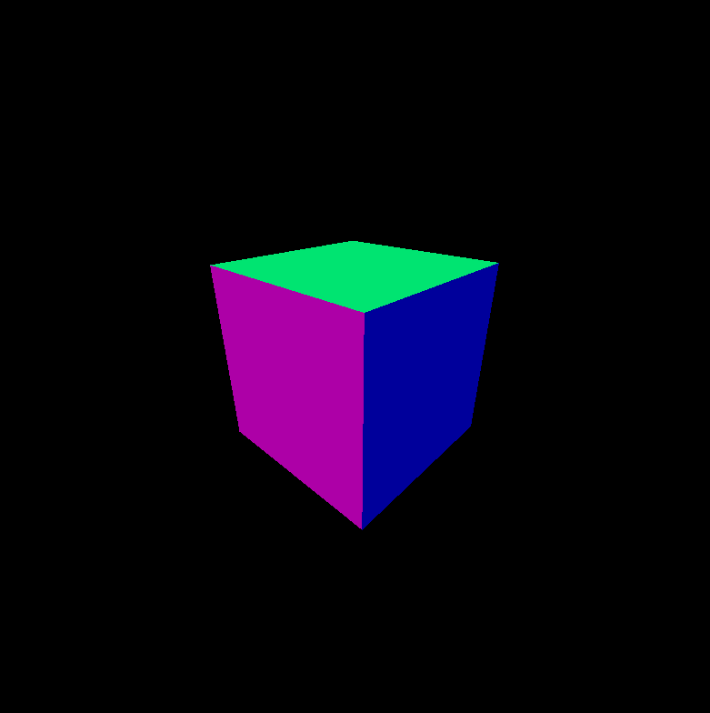

[Video Demo](https://youtu.be/kjadBVjjtRc)

## Tile-based Rendering

This project also implements tile-based rendering to further speed up computation time. Tile-based rendering is a rendering technique  that divides the view port into smaller "tiles" to be rendered individually and then merged back into the full image. Since each tile is relatively small, the GPU can fully take advantage of cache locality/on-chip memory to drastically reduce memory access time and thus speed up rendering. This technique is widely used in GPU everywhere, although it is important for mobile GPUs that doesn't have as much global memory/speed to throw around as desktop GPUs. 

For example: here's what the underlying tile system using 16x16 pixel tiles looks like:
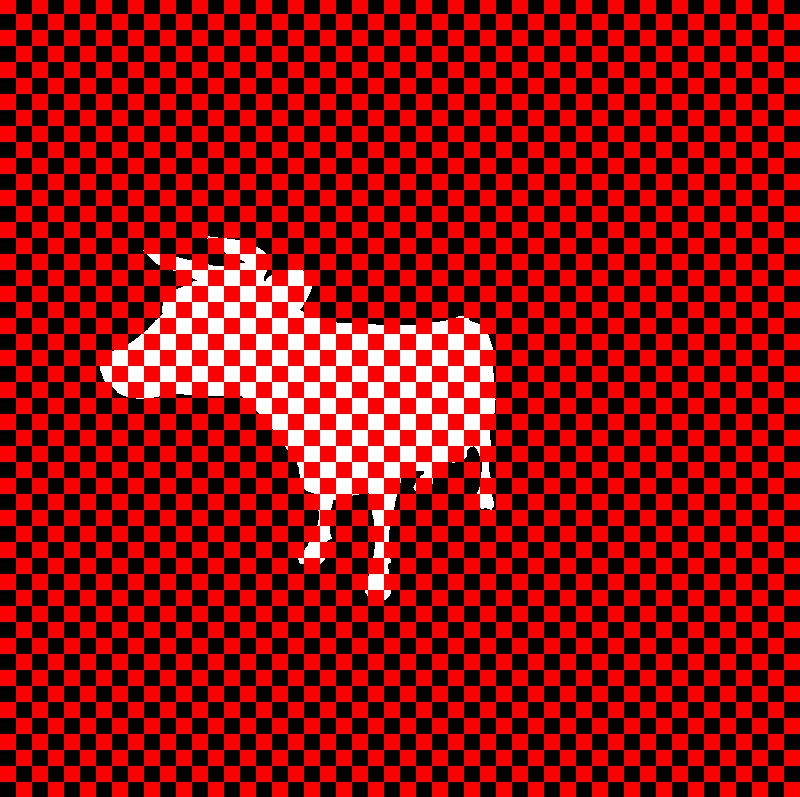

There are many ways of implementing tile-based rendering on the GPU. I implemented 2. One way is to parallize kernel calls over tiles and loop through every triangle in the tile in the kernel. One kernel is called and each thread handles one tile. Another way is to iteratively call kernels on every tile, parallizing over the triangles in that tiles. The Kernel is called as many times as there are tiles and each thread handles one triangle in one tile. I implemented both of these methods. The second method uses shared memory on the GPU to speed up computation. 

## Performance Test

First I compared the FPS of all 3 methods (regular, tile-parallized, triangle-parallized) on a single Triangle, rendered at two different distances from the camera.

### Single Triangle

Far Triangle               |  Close triangle
:-------------------------:|:-------------------------:
  |  

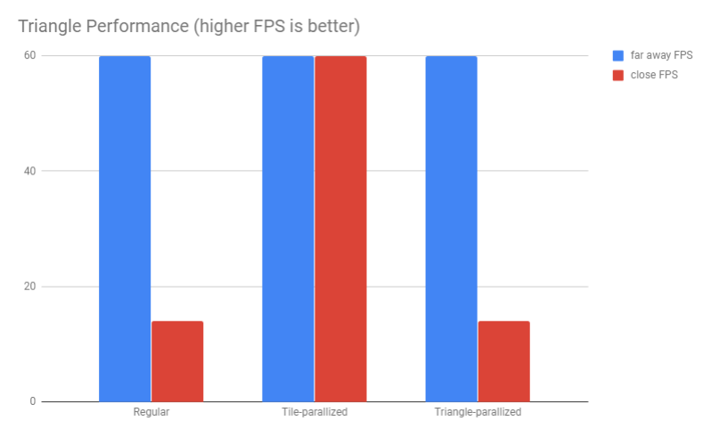

While all 3 methods renders the far away triangle well, only the tile-parallized method did not suffer from a huge speed decrease when the triangle is close. This is likely due to the fact that method 1 and 3 parallizes over the triangle while method 2 parallizes over the tile. Even though the triangle is taking over a lot of screen space, method 1 still uses only 1 thread to process everything, while method 2 uses as many threads as the number of tiles overlapped by this triangle. I'm unclear why method 3 is just as slow though, since it's supposed to parallize over triangles per tile so it should be just as fast as method 2 if not faster.

### Cube

Far Cube                   |  Close Cube
:-------------------------:|:-------------------------:
   |  

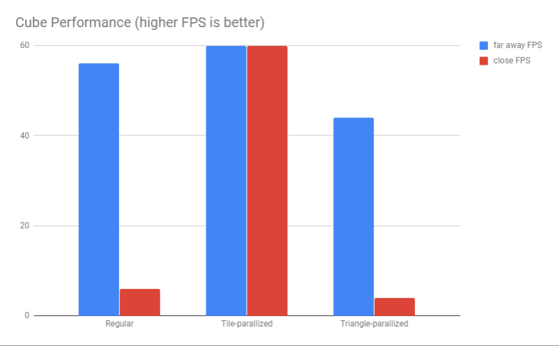

Next I performed the same test on a simple 6 sides cube (12 triangles). The results are pretty much the same as the last test. When individual triangles take up a lot of screen space, method 1 always triumphs.

### Cow

Far Cow                  |  Close Cow
:-----------------------:|:-----------------------:
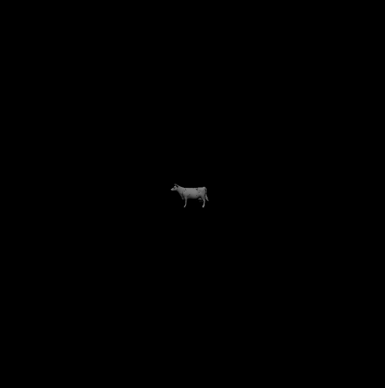  |  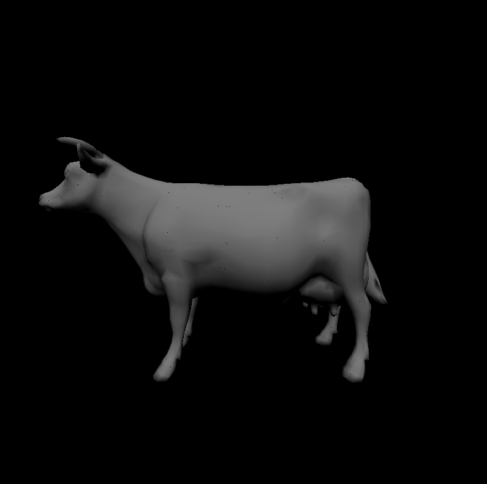

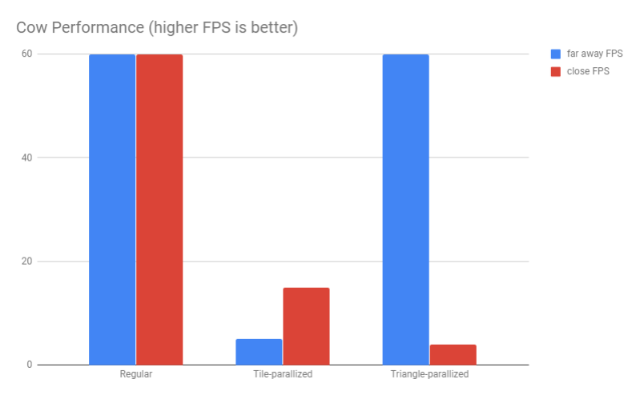

The final test is done on the cow model, and here method 1 starts to show its weakness. When the model is far and triangles are squished up into a small amount of tiles, method 1 is significantly slower than method 1, which launches a thread for every triangle. The performance is a little better when the cow is closer, but still not enough.

The tests reveal clearly that regular rendering is great for rendering scenes with a large amount of triangles taking up screen space. When models are up close and a small amount of triangles are taking up the whole screen, tile-based rendering is better. Perhaps a heuristic can be used at the beginning of every frame to determine which rendering method would be better.

Method 2 is supposed to be the best of both worlds, seeing how it launches a thread per triangle per tile, but it's performing rather poorly in all cases. I think there might be something wrong with my implementation. 

### Pixel Size 

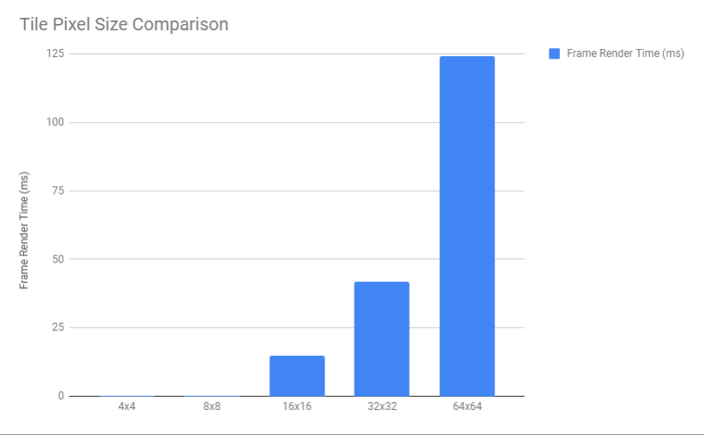

Lastly I compared the render time per frame (averged over 100 frames) of different pixel sizes on the close cube render. Lower is better in the graph. Without a doubt, the smaller sized tiles won, because smaller tiles = more number of tiles = more threads. I do think that eventually smaller tile sizes would run into trouble when memory/overhead is more limited. But it wasn't a problem at all on my 16 Gigs of GPU RAM.  

### Credits

* [tinygltfloader](https://github.com/syoyo/tinygltfloader) by [@soyoyo](https://github.com/syoyo)
* [glTF Sample Models](https://github.com/KhronosGroup/glTF/blob/master/sampleModels/README.md)
* CIS 565 class slides

### Bloopers

When you mess up near/far planes and accidentally summon the cow of nightmares
