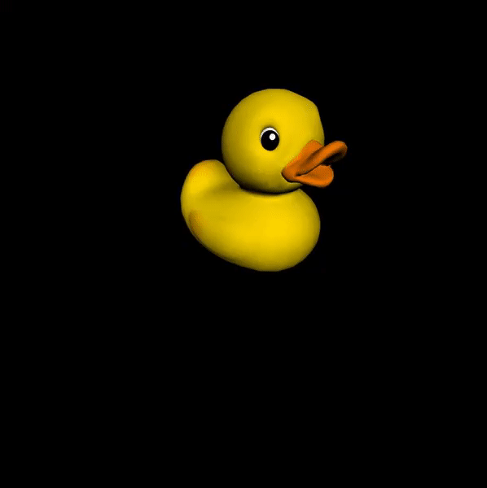
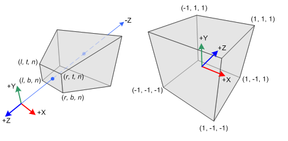
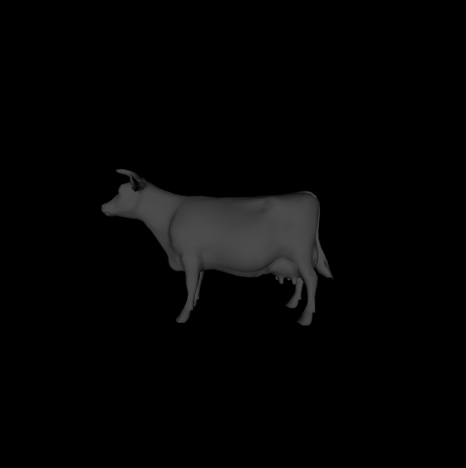
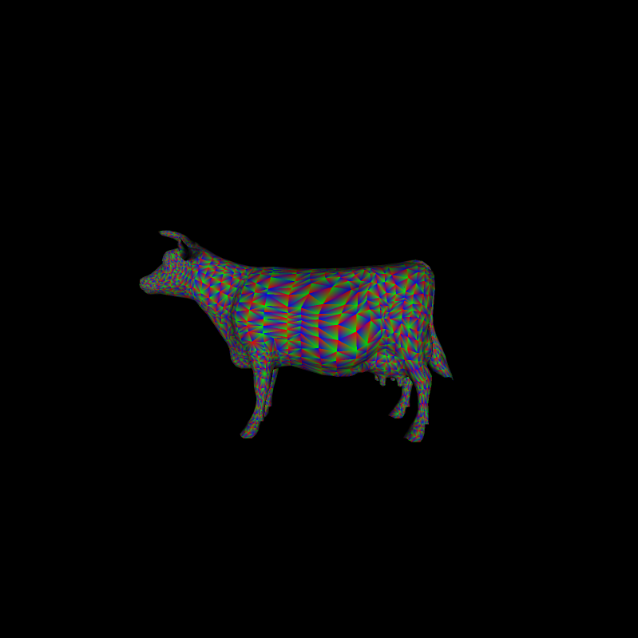

CUDA Rasterizer
===============
**University of Pennsylvania, CIS 565: GPU Programming and Architecture, Project 4 - Rasterizer**

* Liam Dugan
  * [LinkedIn](https://www.linkedin.com/in/liam-dugan-95a961135/), [personal website](http://liamdugan.com/)
* Tested on: Windows 10, Ryzen 5 1600 @ 3.20GHz 16GB, GTX 1070 16GB (Personal Computer)

What is Rasterization?
=============

Rasterization, unlike path or ray tracing has no concept of light rays and is therefore a much faster method of rendering 3D models to the screen. 

A rasterizer pipeline has 5 basic stages:
1. **Vertex Shader** -- Transforms the vertices to the correct coordinates
2. **Primitive Assembly** -- Assembles the vertices into triangles
3. **Rasterization** -- Determine what pixels on the screen correspond to each triangle
4. **Fragment Shader** -- For each pixel, determine the color and lighting effect to use
5. **Output** -- Write the color values for each pixel to the output

Each of these stages is **Embarassingly Parallel** so rasterization is sped up greatly with the help of the GPU.

For example, instead of looping over each pixel for every triangle in a scene sequentially, we can instead create one thread per triangle and have all threads loop over only their own triangle's bounding box. This allows rasterization to give smooth real time rendering of 3D models.

Extra Features
=============

UV texture mapping & Super-Sample Antialiasing
-------

By interpolating between the texture coordinates of each vector we are able to get a mapping from a texture onto our model. Additionally, if we render the model at x4 resolution and then scale it down, we can get an image that is of much higher quality and has much fewer artifacts.

Color interpolation
-------

By assigning the color of a given pixel to be equal to it's barycentric coordinate with respect to a triangle, we get a very nice multicolor effect that shows off how many triangles there are in these models.

### Credits

* [tinygltfloader](https://github.com/syoyo/tinygltfloader) by [@soyoyo](https://github.com/syoyo)
* [glTF Sample Models](https://github.com/KhronosGroup/glTF/blob/master/sampleModels/README.md)
