CUDA Rasterizer
===============

[CLICK ME FOR INSTRUCTION OF THIS PROJECT](./INSTRUCTION.md)

**University of Pennsylvania, CIS 565: GPU Programming and Architecture, Project 4**

* Siyu Zheng
* Tested on: Windows 10, i7-8750 @ 2.20GHz 16GB, GTX 1060 6GB, Visual Studio 2015, CUDA 8.0(Personal Laptop)

## CUDA Rasterizer

| Duck        | Cesium Milk Truck           |
| ------------- |:-------------:|
| 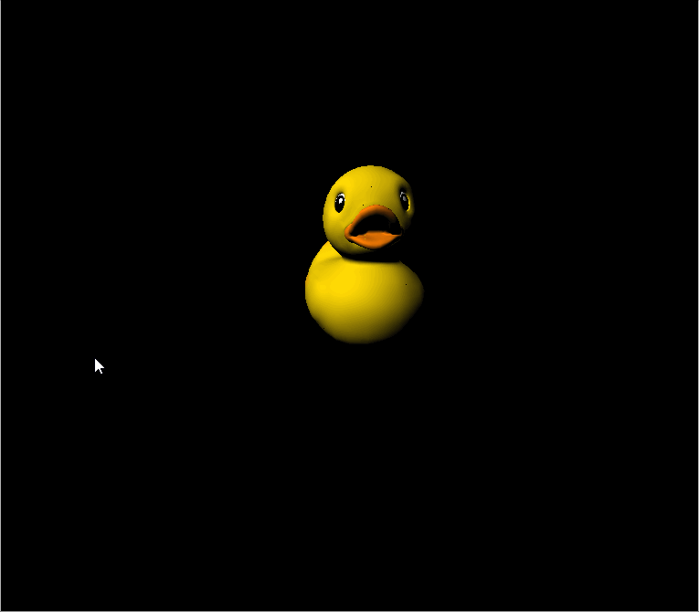      | 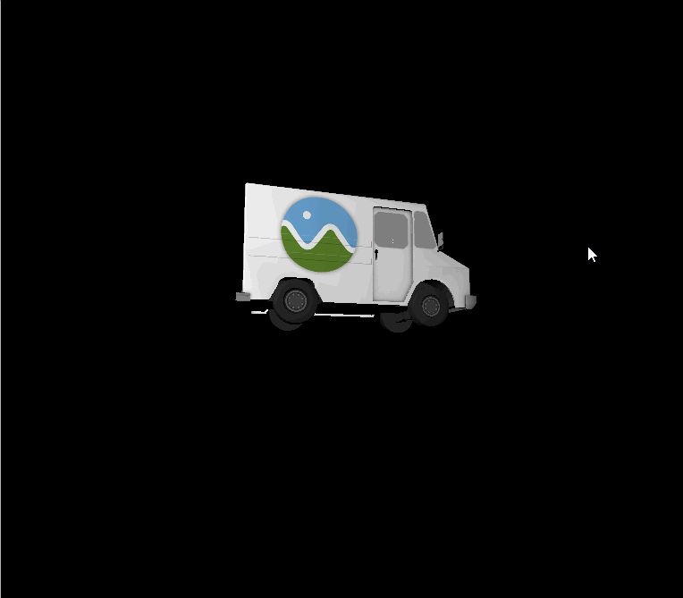   |

### Shading Methods
| Lambert        | Blinn-Phong            |
| ------------- |:-------------:|
| 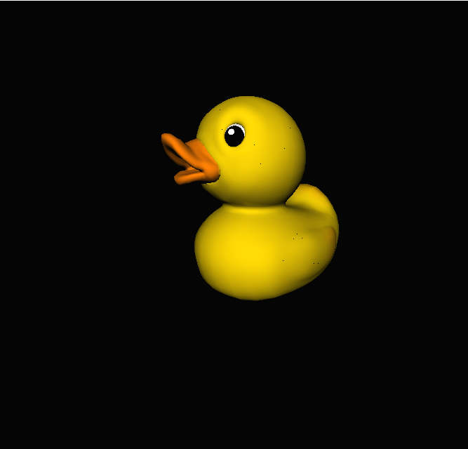      | 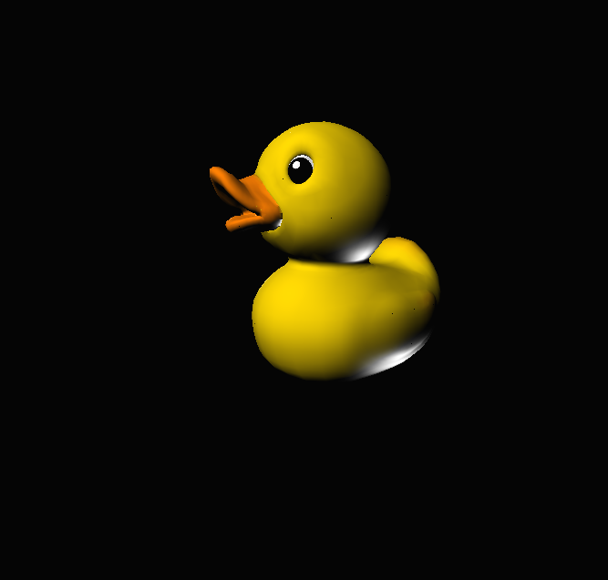   |

Use different shading methods to render the object.

### Perspective correct texture 

| Non-perspective correct        | Perspective correct             |
| ------------- |:-------------:|
| 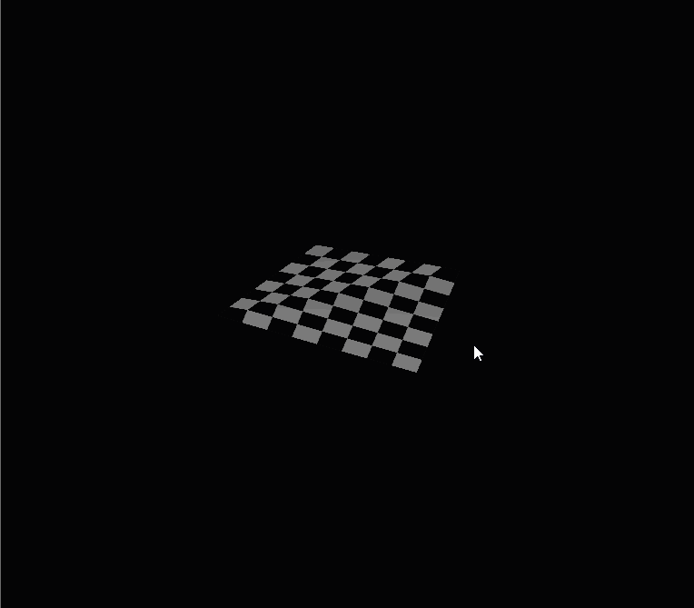      | 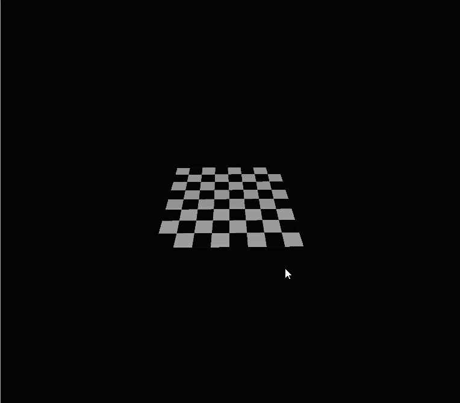   |

Use perspective-correct interpolation instead of barycentric inperpolation on z. Then update the depth if needed and do perspective correct inperpolation on non-positional vertex attributes of this fragment. It's quite obvious that without perpective correct interpolation, the display of checkerboard is wrong.

### Bilinear texture filtering
| Non-bilinear       | Bilinear  texture filtering            |
| ------------- |:-------------:|
| 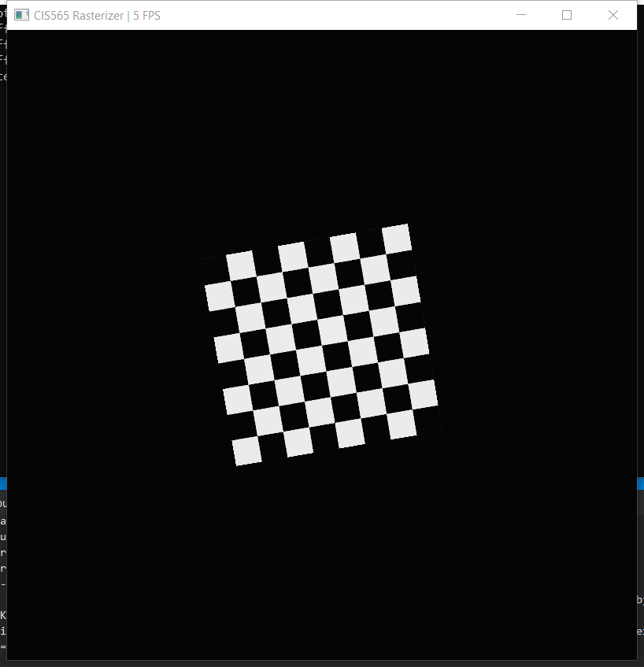      | 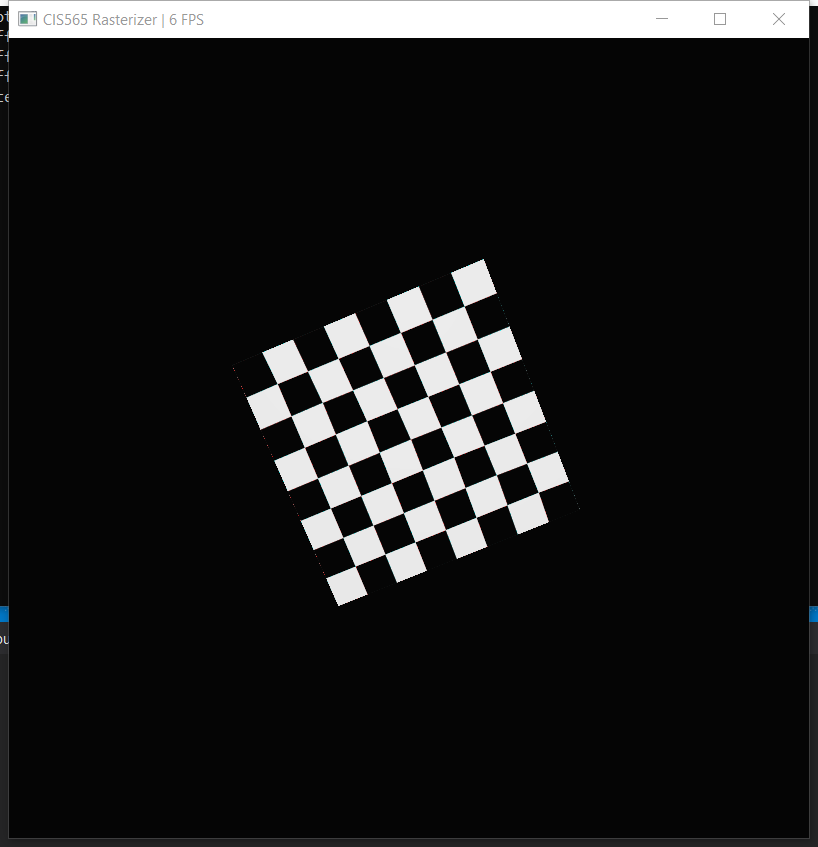   |

Use four texture points nearest to the point that the pixel represents and interpolate the color value. As the graph shows, the edge in checker board with bilinear texture filtering is more smooth.

### Color Interpolation
| Triangle       | Box            |
| ------------- |:-------------:|
| 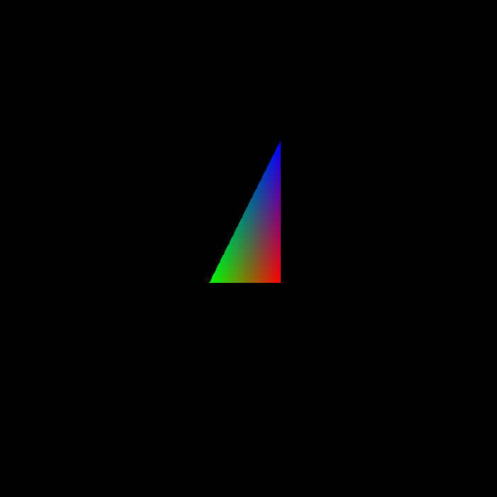      | 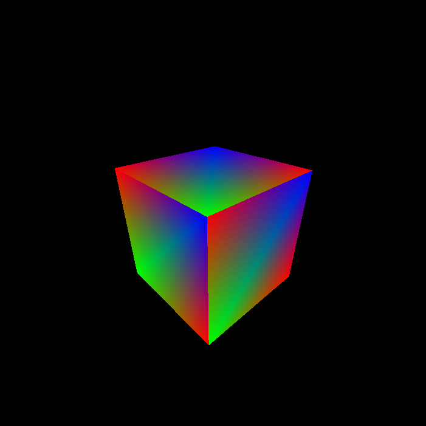   |

Assign red, green and blue for vertices of each triangle then use barycentric interpolation to calculate the color of each pixel in that triangle.

### Rasterize point and line
| Point cloud       | Wireframe            |
| ------------- |:-------------:|
| 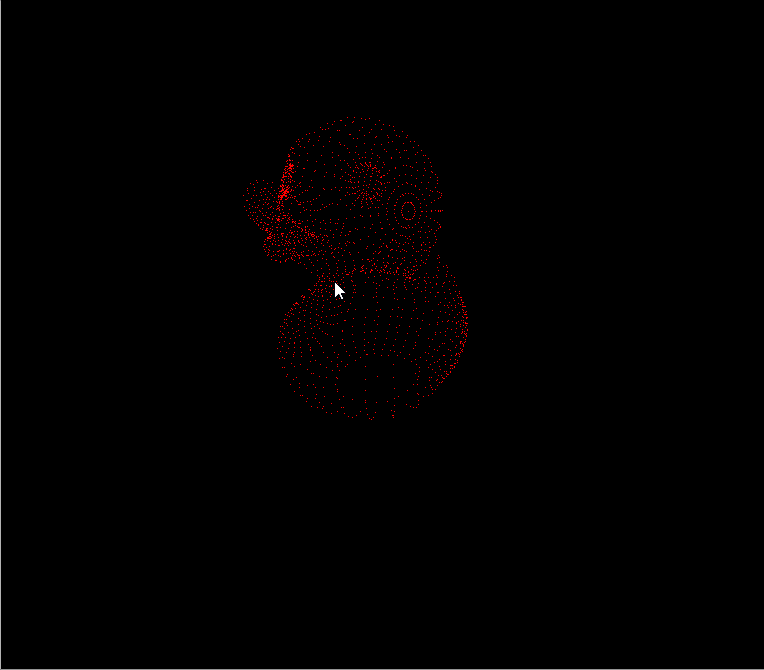      | 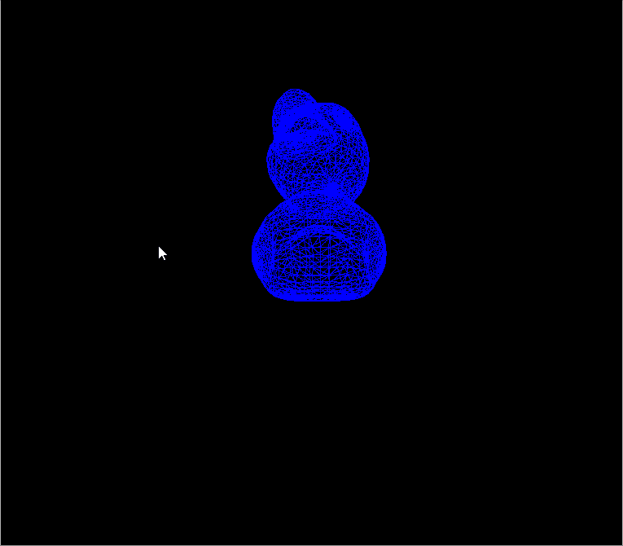   |

For rasterizing points, check if that position of the fragment is in the screen and assign each fragment with a color on that pixel.

For rasterizing lines, loop all edges for each triangle and calculate the length for each line segment. Divide the line segment into tiny subdivision then assigned color on that pixel. 

### Perform Analysis

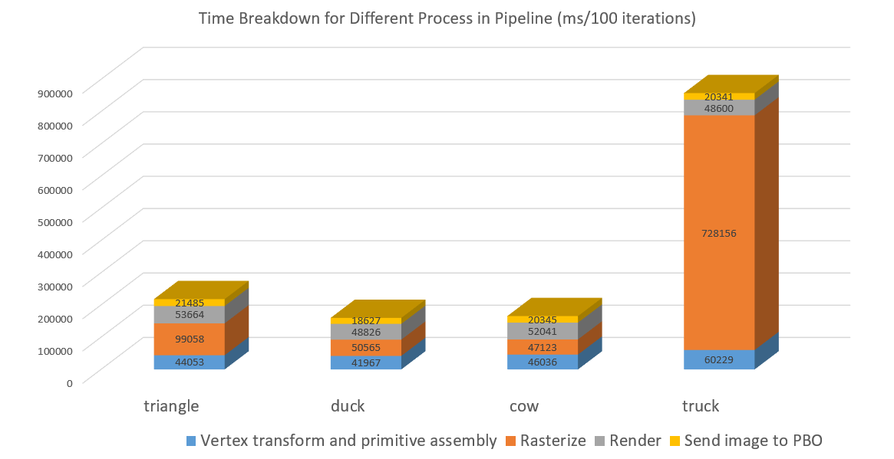

Recorded the running time for each process. In general, vertex transform and primitive assembly took about similar amount of time for different test files. We can see that in truck example, the rasterization took most of the time since Cesium Milk Truck has several different texture. For rendering, there is only some shading methods so it doesn't cost much of time. For sending image to PBO, it took similar amount of time for different objects.

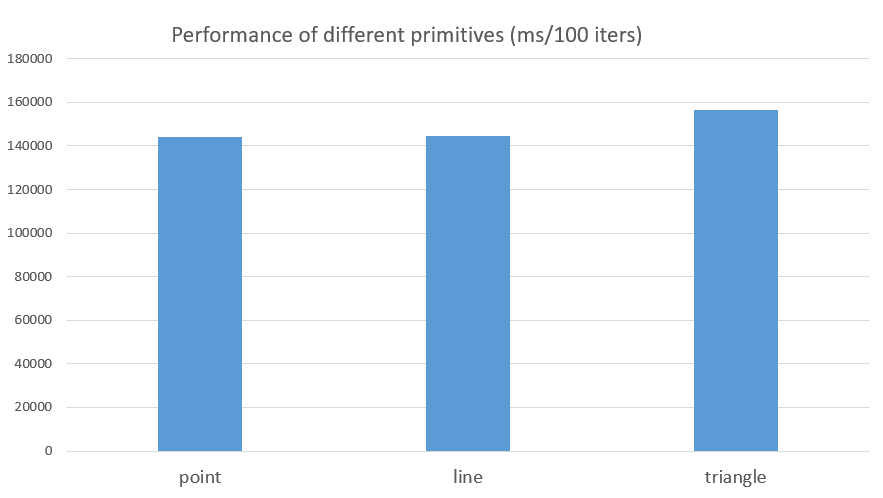

The running time for different primitive types. Rasterizing triangle cost a little bit more time than point and line. 

### Credits
* [Bilinear filtering Wiki](https://en.wikipedia.org/wiki/Bilinear_filtering)
* [tinygltfloader](https://github.com/syoyo/tinygltfloader) by [@soyoyo](https://github.com/syoyo)
* [glTF Sample Models](https://github.com/KhronosGroup/glTF/blob/master/sampleModels/README.md)
