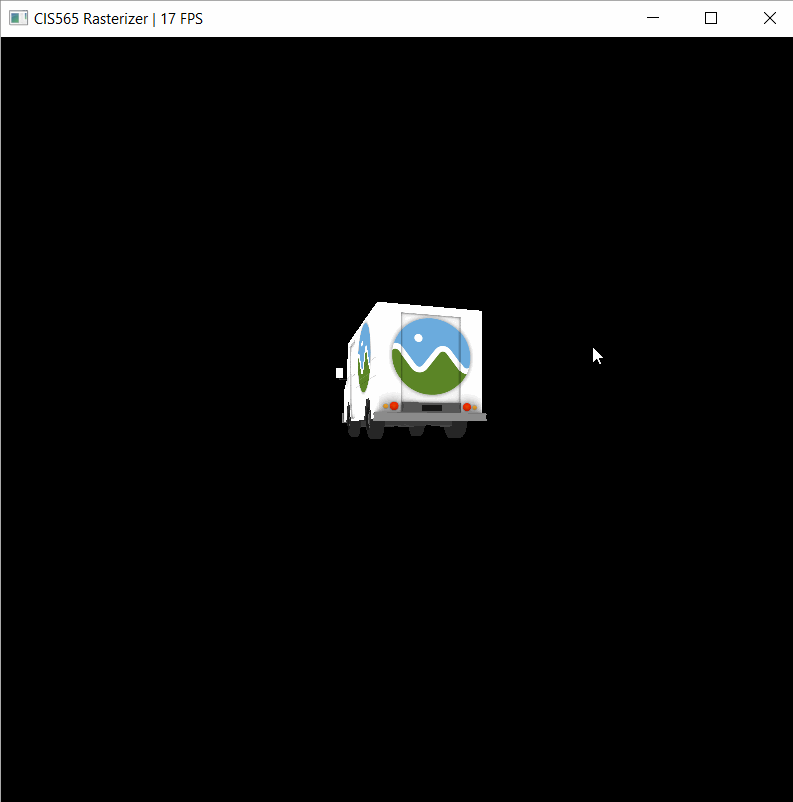
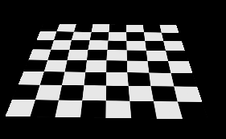

CUDA Rasterizer
===============

[CLICK ME FOR INSTRUCTIONS FOR THIS PROJECT](./INSTRUCTION.md)

**University of Pennsylvania, CIS 565: GPU Programming and Architecture, Project 4**

* Angelina Risi
  * [LinkedIn](www.linkedin.com/in/angelina-risi)
  * [Twitter](https://twitter.com/Angelina_Risi)
* Tested on: Windows 10, i7-6700HQ @ 2.60GHz 8GB, GTX 960M 4096MB (Personal Laptop)
  
  

  
## Features

### Texturing
  

  
#### Bilinear Texture Filtering  
  
Since vertices are given specific UV coordinates on the texture in floating point values normalized 0 to 1, there are bound to be issues with texture scaling and aliasing effects. Bilinear filtering blurs the target texel with its neighbors, smoothing the drawn texture, using linear interpolation. The coefficient used for interpolating in this case is the difference between the integer and float values of the texel index. The code design was actually based off the [Wikipedia page](https://en.wikipedia.org/wiki/Bilinear_filtering) and handles edge cases by wrapping the texture.
  
#### Perspective-Correct Texture Mapping
  
If you only compute the fragment attributes using the original vertex attributes and barycentric weights, you get "alline" interpolation. The problem with this method is most clearly seen in textures when perspective is used, and results in the texturing of neighboring triangles appearing "disjoint" with one another. To fix this, a perspective adjustment was applied by calculating the perspective-correct depth "w" and multiplting each contribution by this factor divided by the vertex z position for that attribute. In code:  
  
```cpp
// "bary" is the barycentric weights, and "tri" stores the vertex positions
float w = 1.0f / ((bary.x / tri[0].z) + (bary.y / tri[1].z) + (bary.z / tri[2].z));

fragBuf[f_idx].texcoord0 = w * (  (p.v[0].texcoord0 * bary.x / tri[0].z) 
                                 + (p.v[1].texcoord0 * bary.y / tri[1].z) 
                                 + (p.v[2].texcoord0 * bary.z / tri[2].z));
```
  
The result is reduced unwanted distortion on attributes due to distortion (the same formula can be used on normals, colors, etc). A comparison between affine (first image) and corrected (second image) textering is seen below for a checkerboard texture: 
  
   
  
The second image also has bilinear filtering. While the pattern does not look perfect, probably due to rounding errors, it is singnificantly improved from the affine case.
  
  
### Depth Buffer  
  
Both a integer depth buffer and an integer mutex buffer are stored with one entry per fragment. This simple implementation uses the mutex to force access to the depth buffer, and then to the fragment buffer, as a critical section. While this will affect the reasterizer speed, sometimes significantly, it avoids any race conditions caused by multiple primitives overlapping the same pixel coordinate. Currently it only has integer precision, so z-fighting for close objects may not be completely avoided. Part of the rasterizer code has been reproduced below. The relevant part is the "do while" loop that creates a critical section preventing access to the current fragment index by all other threads by using an atomic function to lock the address.
  
```cpp
inside = isBarycentricCoordInBounds(bary);

float z_float = getZAtCoordinate(bary, tri);
if (z_float < 0 || z_float > 1) continue;
int z = z_float * INT_MAX;

bool isSet = false;

if (inside) {
    isSet = false;
    do {
        isSet = (atomicCAS(mutex + f_idx, 0, 1) == 0);
        if (isSet) {
            // Critical section
            if (z < depth[f_idx]) {
                depth[f_idx] = z;
                fragBuf[f_idx] = f_true;
            }
        }
        if (isSet) {
            mutex[f_idx] = 0;
        }
    } while (!isSet);
}
```
  
  
  
  
  
  
  
### Credits

* [tinygltfloader](https://github.com/syoyo/tinygltfloader) by [@soyoyo](https://github.com/syoyo)
* [glTF Sample Models](https://github.com/KhronosGroup/glTF/blob/master/sampleModels/README.md)
