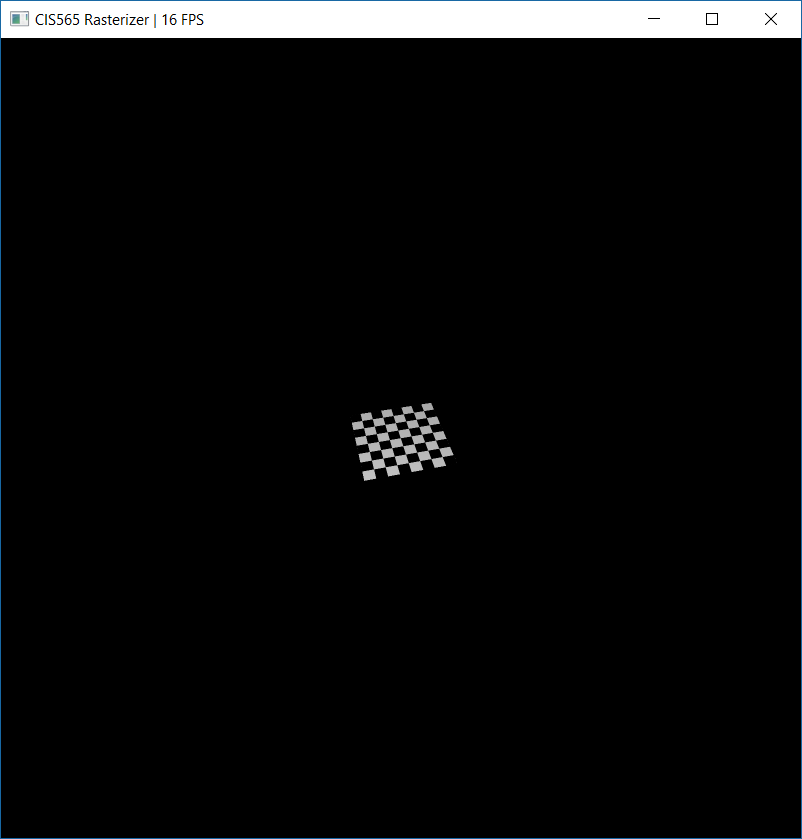
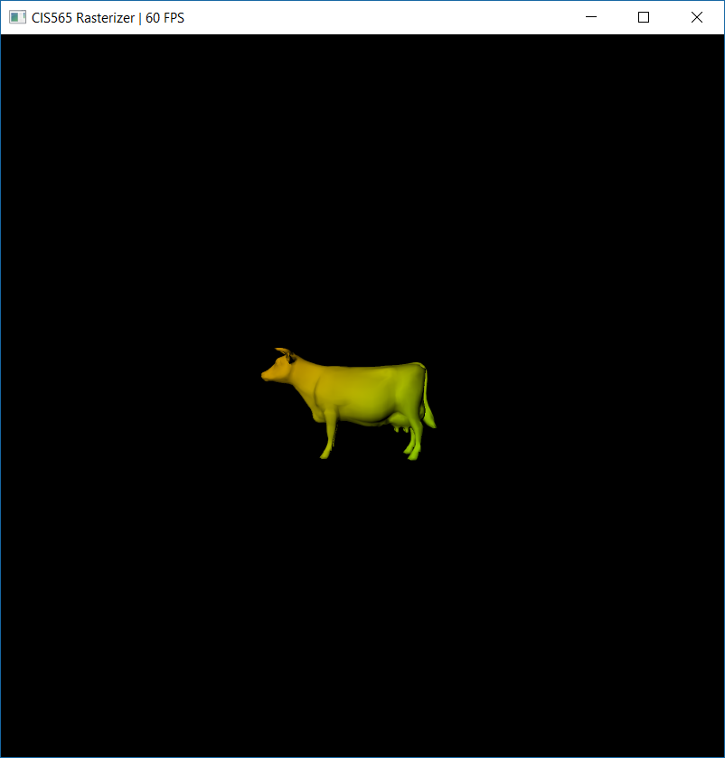
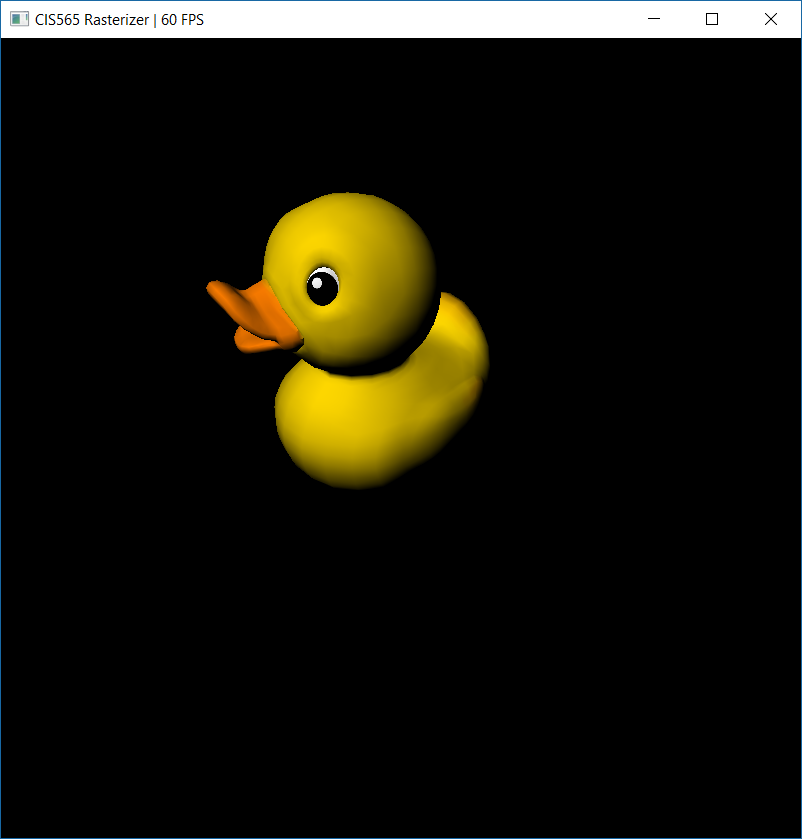
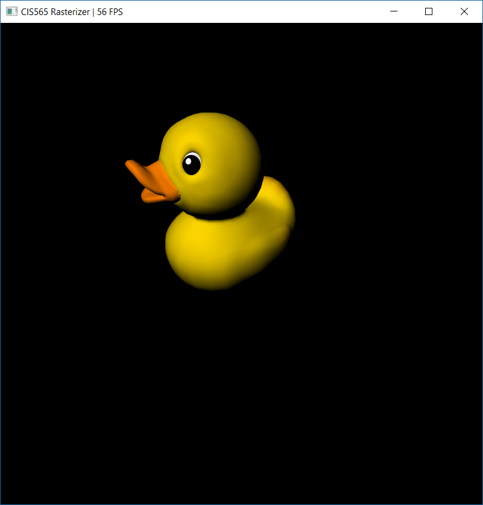
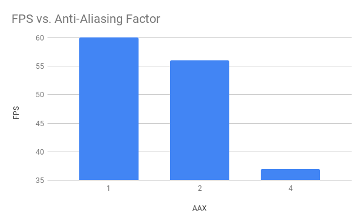
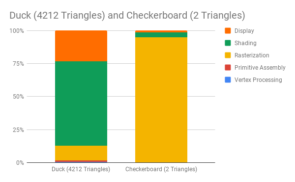

CUDA Rasterizer
===============

* Zach Corse
  * LinkedIn: https://www.linkedin.com/in/wzcorse/
  * Personal Website: https://wzcorse.com
  * Twitter: @ZachCorse
* Tested on: Windows 10, i7-6700HQ @ 2.60GHz 32GB, NVIDIA GeForce GTX 970M (personal computer)

## README

Introduction
------------

This is a CUDA rasterizer that includes the standard rasterization pipeline, including:

* Vertex shading
* Primitive assembly
* Rasterization
* Fragments to depth buffer
* Fragment shading
* Fragment to framebuffer writing

For rasterization, I implemented a naive parallelization per triangle, checking all fragments in a particular triangle's bounding box (in barycentric coordinates) before adding a particular fragment to the scene fragment buffer, assuming it clears the depth buffer. The depth buffer itself is regulated by a mutex lock buffer, which ensures that a particular index in the depth buffer is not being written to or read from while another thread is writing to that index.

As will be shown in the performance section below, a tile-based rendering system would be more efficient in some cases than parallelization by triangle primitive.

Features
------------

Present features included in my rasterizer. See below for sample renders and performance analysis!

1. Basic Rasterizing
   * Rasterizes per triangle primitive
   * Depth buffer regulated by mutex lock buffer
2. Textures
   * Includes bilinear interpolation sampling
3. Color interpolation
4. Lambertian Shading
5. Anti-Aliasing

Textures
------------

*Shading includes textures*

Textures are drawn using perspective-correct interpolation. UV coordinates, which are not discrete, are interpolated using neighboring pixel values using bilinear interpolation.

Color Interpolation
------------

*Shading includes vertex color interpolation when no texture is specified.*

Anti-Aliasing
------------

*No AA. Jagged edges can be seen on edge of duck.*

*With AA X 2. Jagged edges are smoothed.*

We see here that, although anti-aliasing does provide a smoother picture, it comes with an associated drop in FPS.

Performance
------------

From the graph below, which depicts the percentage of computational time each step in the rasterization pipeline takes, we can divine a few limitations of my implementation. First of all, we see that large triangles take a disproportionate amount of time to rasterize (the checkerboard is only two triangles). Because my implementation loops over all primitives, and for each primitive, it tests all pixels in that primitive's bounding box, larger triangles will have more pixel misses, and for those pixels that do fall within the triangle, these must be drawn serially. Conversely, the duck, although it has over 4,000 triangles, has relatively smaller triangles, which draw quickly in parallel.

Now consider the duck's timing proportion. Here, the camera, in its default position, is zoomed out, such that the duck takes a relatively small proportion of the screen. However, while this means that fewer pixels need to be checked against each primitive, it also means that there will be proportionally fewer fragments to shade. Anti-aliasing X2, which quadruples the number of fragments, also quadruples the number of screen-space pixels that need to be checked in triangle bounding boxes, so this shouldn't affect the relative timing between rasterization and shading. I must therefore conclude that texture reading, bilinear interpolation, and lambertian shading, together, are relatively costly.

### Credits

* [tinygltfloader](https://github.com/syoyo/tinygltfloader) by [@soyoyo](https://github.com/syoyo)
* [glTF Sample Models](https://github.com/KhronosGroup/glTF/blob/master/sampleModels/README.md)
