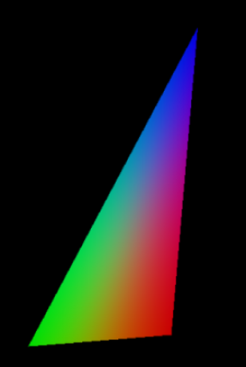
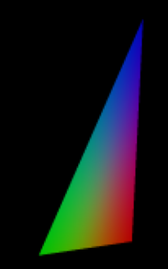

CUDA Rasterizer
===============

**University of Pennsylvania, CIS 565: GPU Programming and Architecture, Project 4**

* Ziad Ben Hadj-Alouane
  * [LinkedIn](https://www.linkedin.com/in/ziadbha/), [personal website](https://www.seas.upenn.edu/~ziadb/)
* Tested on: Windows 10, i7-8750H @ 2.20GHz, 16GB, GTX 1060

# Project Goal

  

In this project, I implemented a Path Tracer using the CUDA parallel computing platform. Path Tracing is a computer graphics Monte Carlo method of rendering images of three-dimensional scenes such that the global illumination is faithful to reality. 

# Rasterizer Intro

  

Rasterization is a fast rendering technique used in computer graphics. In simple terms, after loading in a model in memory, we identify triangles that constitute the geometry, and then test the intersection of screen pixels with these triangles. In the end, we render the closest intersected pixels. The image above showcases which pixels are considered intersected with the loaded triangle.

This project implements a full rasterization pipeline with GLTF assets support:
1. Load in GLTF asset into memory
2. Transform the vertices from model space to pixel space using camera projection
3. Assemble transformed vertices into packages (normals, colors, textures, etc..) with triangulation
4. Perform triangle/pixel intersection (rasterization)
5. Color identified fragments
6. Send the buffer of colored fragments to the display

## Scenes
### Flower
| Depth View | Normals View | Colored View - Lambert |
| ------------- | ----------- | ----------- |
| 

| 

 | 

 |

### Duck
| Depth View | Normals View | Textured View |
| ------------- | ----------- | ----------- |
| 

| 

 | 

 |

### CesiumTruck
| Depth View | Normals View | Textured View |
| ------------- | ----------- | ----------- |
| 

| 

 | 

 |

## Extra Features
### Supersampling - Anti-Aliasing
| Without SSAA | With SSAA | 
| ------------- | ----------- |
|  |  |

Supersampling is type of anti-aliasing in which we render the image at a higher resolution (say 4x), then for the final output we downsample. This means that if for each final pixel we supersampled 4 other pixels, then the final color of a pixel is the average of those 4. This diminishes issues with stair-step like lines that should be smooth instead.

### Perspective Correct Color

### Texture Mapping with Bilinear Filtering

# Build Instructions
1. Install [CMake](https://cmake.org/install/)
2. Install [Visual Studio 2015](https://docs.microsoft.com/en-us/visualstudio/welcome-to-visual-studio-2015?view=vs-2015) with C++ compativility
3. Install [CUDA 8](https://developer.nvidia.com/cuda-80-ga2-download-archive) (make sure your GPU supports this)
4. Clone this Repo
5. Create a folder named "build" in the root of the local repo
6. Navigate to the build folder and run "cmake-gui .." in a CLI
7. Configure the build with Visual Studio 14 2015 Win64, then generate the solution
8. Run the solution using Visual Studio 2015
10. Build cis_565_rasterizer and set it as Startup Project
9. Run cis_565_rasterizer with command line arguments: ../gltf/name_of_gltf_folder/name_of_gltf_file.gltf

### Credits

* [tinygltfloader](https://github.com/syoyo/tinygltfloader) by [@soyoyo](https://github.com/syoyo)
* [glTF Sample Models](https://github.com/KhronosGroup/glTF/blob/master/sampleModels/README.md)
