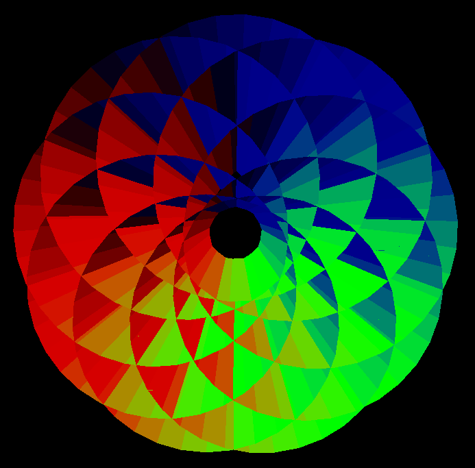
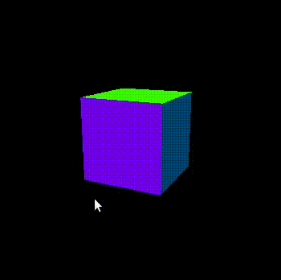
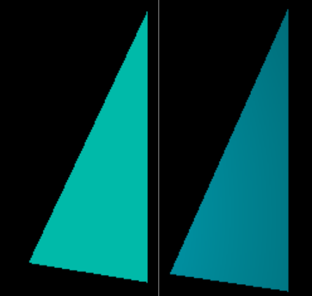
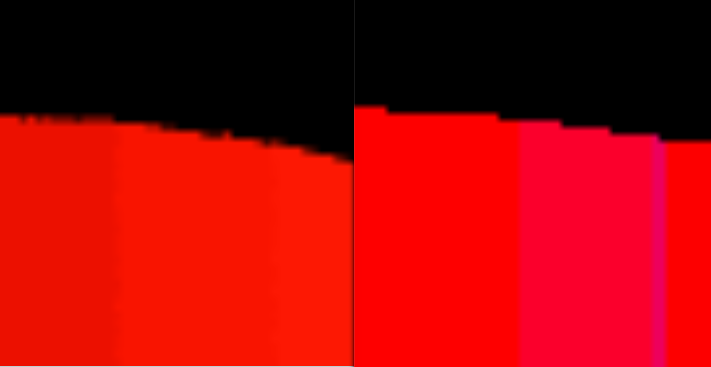
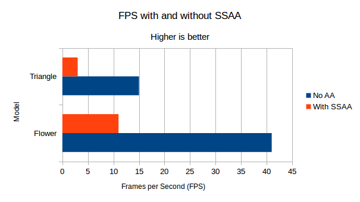
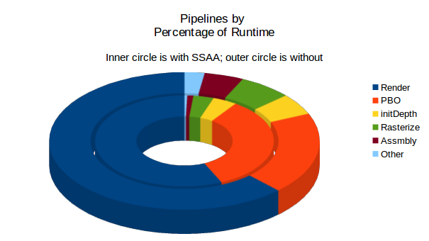
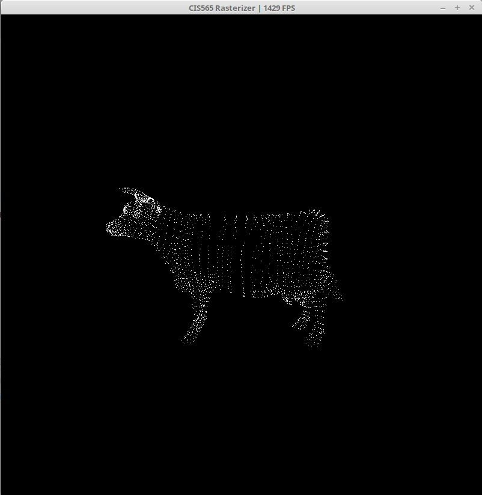
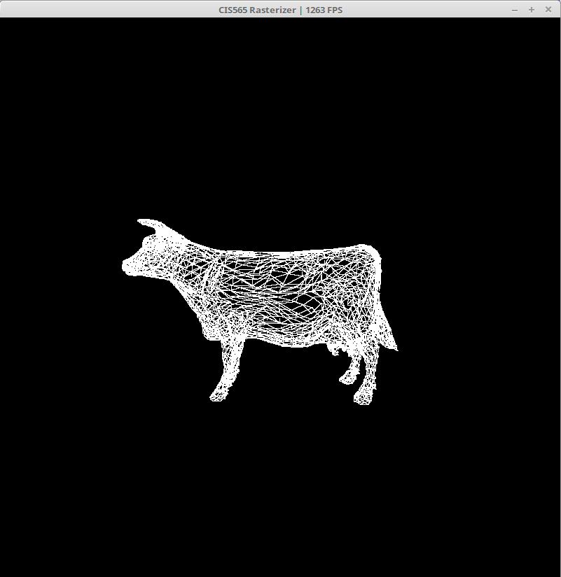
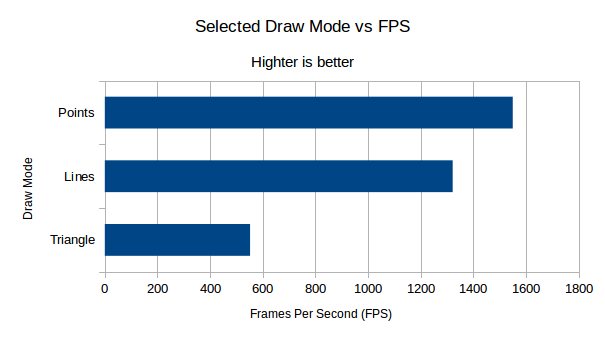
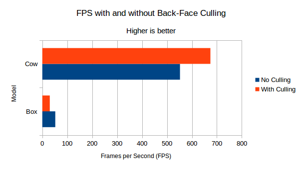

CUDA Rasterizer
======================

**University of Pennsylvania, CIS 565: GPU Programming and Architecture, Project 4**

* Edward Atter
  * [LinkedIn](https://www.linkedin.com/in/atter/)
  * Tested on: Linux Mint 18.3 Sylvia (4.13.0-41-generic), Ryzen 7 2700x @ 3.7 ghz (base clock) 16GB, GTX 1070 TI 8GB GDDR5 (Personal)
  * CUDA 9

## Overview

A rasterizer takes 3D objects (defined using vector graphics) and converts it into a 2D representation to be viewed on a computer monitor. Rasterization is the technology behind all major video games as it is much faster than path tracing. 

_Note:_ The screen door affect oberserved is due to the conversion from `mp4` to `gif` and **not** an affect of the rasterizer.

This project implements a a rasterizer with the following features:
 - Vertex shading
 - Primitive assembly support
 - Rasterization
 - Fragment shading
 - Depth buffer for storing depth testing fragments
 - Fragment-to-depth buffer with mutex lock to prevent race conditions
 - Lambert fragment shader
 - Supersampling Anti-Aliasing (SSAA) using the ["random" algorithm](https://en.wikipedia.org/wiki/Supersampling#Supersampling_patterns)
 - Point cloud drawing mode
 - Line drawing mode
 - Back-face culling

All features may be toggled by changing the defined constants at the start of `src/rasterize.cu`.

## Features

#### Lambert shading

Lambert shading has no noticable affect on performance. The image on the left is without shading, while the image on the right has Lambert shading enabled. The left image has simple normal coloring while the image on the right uses Lambert shading. 

#### Anti-Aliasing via Supersampling

This technique requires upscaling the image, using one of several methods to "average out" the pixels, and setting this new value in the final image. Specifically, this implementation uses the "random" algorithm. 

A list of nearby pixels is generated (the size of which depends on `OPTION_SSAA_GRID_SIZE`). Then multiple random samples are taken from the nearby pixels. The average of the samples represents the final color in the image. 

SSAA has an significant, negative impact on performance. This is unsuprising, since a much larger image must be generated first, typically with four times as many pixels. However, images can look much more realistic. Humans are accustomed to seeing objects in a continuous space in real life, not broken down into discrete pixels. Anti-aliasing aids to more accurately represent a continuous space. 

The performance impact is further illustrated by the graph below. The flower model is used in this test with a `GRID_SIZE` of 2.

The graph below compares the percentage of time spent in each pipeline stage with and without SSAA. 

It is not surprising to see the PBO stage greatly increase. The random sampling takes place in this stage, allowing us to reduce the supersampled image back to the original resolution. I was surprised to see the render stage decrease. It is important to keep in mind, however, that this is representing the relative percentage of overall time, not the total time spent in each stage. Further analysis into the profile shows the render time did, in fact, increase with SSAA enabled even though the relative percent of time spent decreased as shown in the graph. This is why the other minor pipeline stages are greatly reduced. With SSAA enabled, the render and PBO stage dominate even more than usual, while the actual time spent in seconds of pipelines such as assembly remain constant.

The benefits of SSAA can be achieved with much higher performance by implementing [MSAA](https://en.wikipedia.org/wiki/Multisample_anti-aliasing). This special case of supersampling only upscales edges of the objects, where anti aliasing provides the largest benefit. Since the entire image is no longer being upscaled, the result is comparable to SSAA with significantly better performance. 

#### Alternate Drawing Modes

In addition to the typical `triangle` mode, `line` and `point` modes are also available. If enabled, the original vector graphic is reduced to solely its vertices (point mode). Line mode takes this one step further, connecting each vertex without filling triangle. Triangle mode uses the normal value for coloring, while all other modes are statically defined to be white. Without the need to fill the image, significantly fewer pixels need to be processed. This results in both point and line modes achieving much higher FPS than the normal triangle mode.

 

The graph below shows the difference in FPS across each of the three drawing modes while drawing the cow model. 

Line drawing may be further improved by calculating each pixel in parallel. Currently, one line is calculated per thread. Utilizing shared memory instead of global memory in all drawing modes is also likely to yield a significant performance benefit. 

#### Back-face culling

In a naive approach, all triangles are rendered whether they are visible in the field of view or not. Back-face culling is meant to improve performance by only rendering the shapes visible to the camera. 

Analysis shows that, at least for this implementation, back-face culling is not guaranteed to improve performance. Like most things in computer science, it depends. Performance actually gets worse with culling enabled when rendering the box model. This is likely because the box has only a small number of large fragments on screen at any given time. The overhead for the culling calculation is simply not woth it. The conclusion is very different for the cow model however. Unlike the box, the cow has many small triangles, only about half of which are visible at a fixed perspective. The cow model is more representative of typical applications, where the detail is high, requiring many small shapes. Thus, it's expected as a whole back-face culling will improve performance in real life applications. 

As with the other features, shared memory would likely help significantly here. As well as some sort of caching for the objects that are not in view. 

## Methodology

When testing performance, the model being rendered was first zoomed to fill the screen. Once the proper size was reached, the FPS was calculated as the average over the next 10 seconds. All models used for testing and shown in the screenshots are available in the `gltf` directory. Unless otherwise specified, all toggleable features except the one being tested were disabled before each performance test. 

## Resources & Credits

 - [glTF Sample Models](https://github.com/KhronosGroup/glTF/blob/master/sampleModels/README.md)
 - [OpenGL.org, Lambert lighting](https://www.opengl.org/sdk/docs/tutorials/ClockworkCoders/lighting.php)
 - [tinygltfloader](https://github.com/syoyo/tinygltfloader) by [@soyoyo](https://github.com/syoyo)
 - [University of Pennsylvania, CIS 565, Skeleton Project](https://github.com/CIS565-Fall-2018/Project4-CUDA-Rasterizer)
 - [Wikipedia, Supersampling](https://en.wikipedia.org/wiki/Supersampling#Supersampling_patterns)

