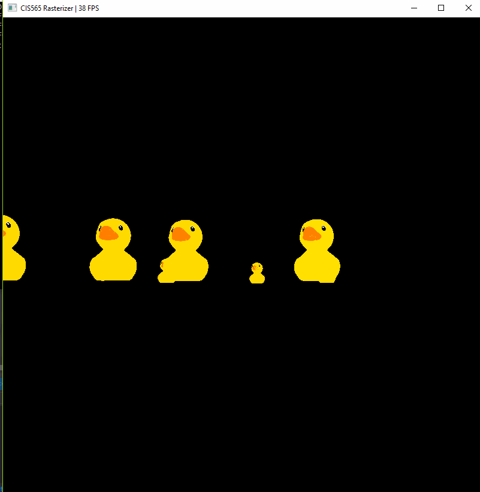
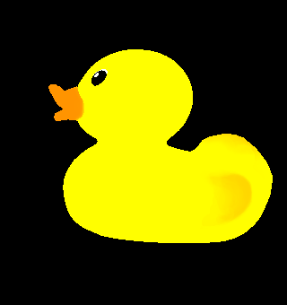
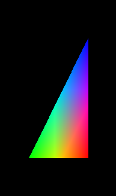
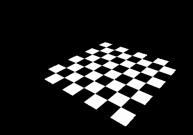
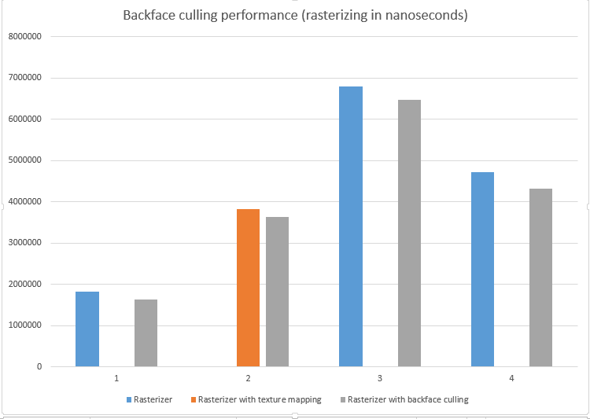
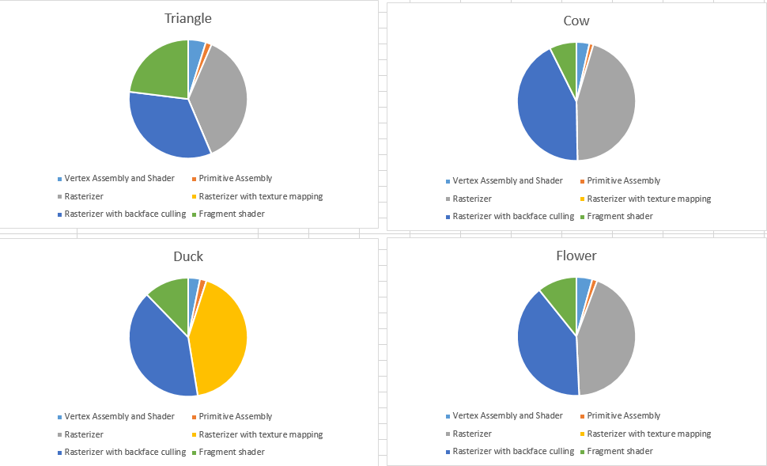

CUDA Rasterizer
===============

* Henry Zhu
  * [Github](https://github.com/Maknee), [LinkedIn](https://www.linkedin.com/in/henry-zhu-347233121/), [personal website](https://maknee.github.io/), [twitter](https://twitter.com/maknees1), etc.
* Tested on: Windows 10 Home, Intel i7-4710HQ @ 2.50GHz 22GB, GTX 870M (Own computer)

## Cuda Strike

- * Reference to the First Person shooter [Counter Strike](https://en.wikipedia.org/wiki/Counter-Strike)

## What is a rasterizer?

A rasterizer is a method of rendering images by forming triangles and converting these triangles to pixels on the screen

In more detail, a rasterizer has a so called graphics pipeline where points from an object's data file are converted to points in the screen space and triangles are formed from three points. From these triangles, an AABB check if performed around the triangles to see what approximate rectangular area the triangle takes up. Then, a scanline method is performed where the rasterizer iterates through all pixels in the AABB A barycentric calculation is performed to check if the pixel is actually in the triangle. If the pixel is, a depth test is checked and if that passes, the pixel(fragment)'s color can be modified from all cool effects such as colors, lights, etc.

## Building / Usage

### Building
- Build using cmake or cmake-gui
- Open sln project in visual studio

### Running

- ./cis565_rasterizer.exe ..\gltfs\duck\duck.gltf

## Basic features
- Entire graphics pipeline
- Lambert shading and blinn-phong shading
- Depth testing

## What advanced features of my rasterizer implement?

- The rasterizer can be actually used to play a game and loads Multiple objects :)
- UV texture mapping with bilinear texture filtering and perspective correct texture coordinates
- Correct color interpolation between points on a primitive
- Backface culling, optimized using stream compaction (with thrust)

## UV texture mapping

### UV texture mapping

### UV texture mapping evaluation

This feature consists of mapping textures onto an object with bilinear filtering and perspective correct texture coordinates. 

Bilinear filtering is sampiling four (u,v)s on a texture and mixing the two based on where the u,v is mapped to on the pixel.

Perspective correct texture coordinates can be done by using a combination of barycentric coordinates and eye coordinates to change the texture color to map to the correct values based on eye position.

#### Performance

The performance did not take too much of a hit. The fps decreased by about a fifth compared to just using colors, but fps is measured as the inverse of the time per frame. The bilinear filtering usage vs not using bilinear filtering causes a slight performance hit. 

#### Future optimizations

An optimization is to precompute the texture values color mapping to the object's triangle points, so that when the camera is moved, all that is needed to be done to color perspective correwct the texture color values. This takes up space, however.

Another way to optimize is not move the camera and save all the texture colors in a buffer that changes when the camera is moved. When the camera is not moving, there is no work to be done.  

## Correct color interpolation between points on a primitive

### Color interpolation evaluation 

Color interpolation is done by correct the color based on baycentric coordinates and the eye's position. This is like mixing the colors between different points as shown in the triangle image.

#### Performance

The performance is not noticable at all. All that was done was add a couple more multiplications and divisions to correctly interpolate color between points

#### Future optimizations

There are not many optimizations as this is multiplying baycentric coordinates to the pixel value and camera values, but one way to speed things up would be to add a cache that maps the baycentric value to different points on a triangle and to compute the pixel value quickly by fetching the baycentric value quickly.

- Backface culling, optimized using stream compaction (with thrust)

### Backface culling evaluation

Backface culling is the technique of removing faces that are not facing towards the camera. This can be done by getting the triangles' normals and dotting that with the camera forward vector. With stream compaction, the primitives can be removed from being calcuated for the screen since the triangles are facing away from the user.

#### Performance

This was a performance hit since triangles facing away from the user are not used in computation and in the end, thrown away. This resulted in a 2x speedup for the duck since half of its triangles were facing away from the camera.

#### Future optimizations

This is an optimization already since this technique removed triangles not facing the same direction as the user. 

But, a way to speed things up is to keep a track of triangles not facing the user and cache that, so stream compaction is used on a smaller part of the total number of primitives

- Performance Analysis 

Chart of each pipeline stage

## Third party usage

### Book
- [PBRT](https://www.pbrt.org/)

### Credits

* [tinygltfloader](https://github.com/syoyo/tinygltfloader) by [@soyoyo](https://github.com/syoyo)
* [glTF Sample Models](https://github.com/KhronosGroup/glTF/blob/master/sampleModels/README.md)
