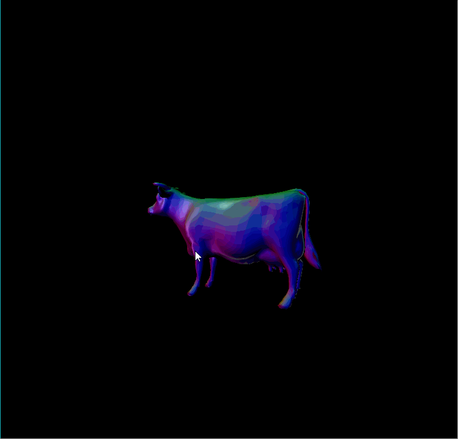
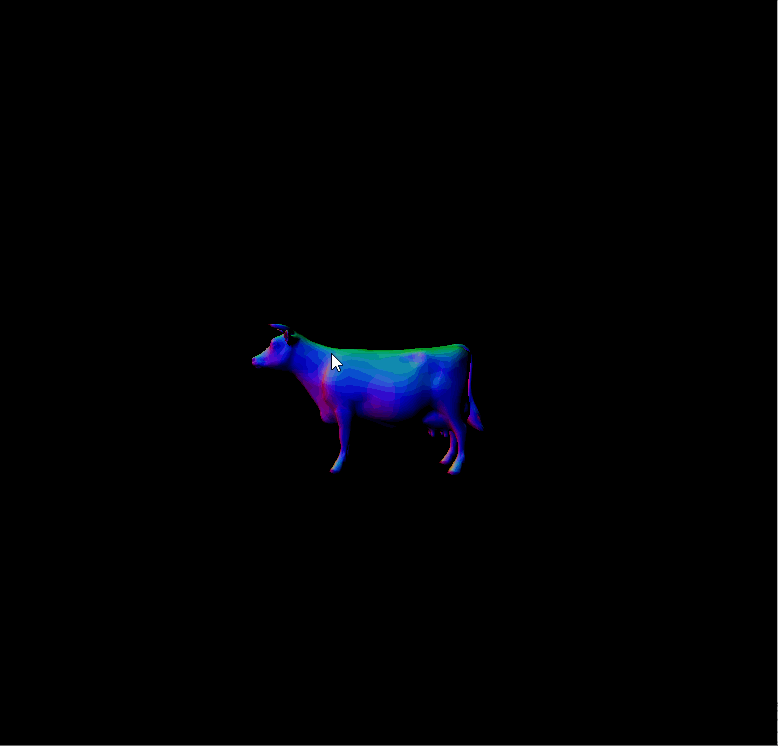
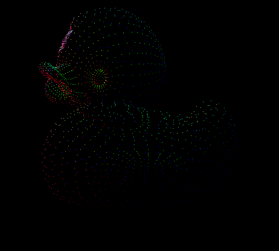
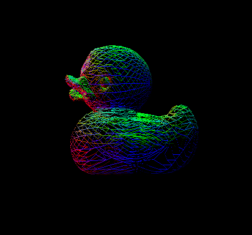
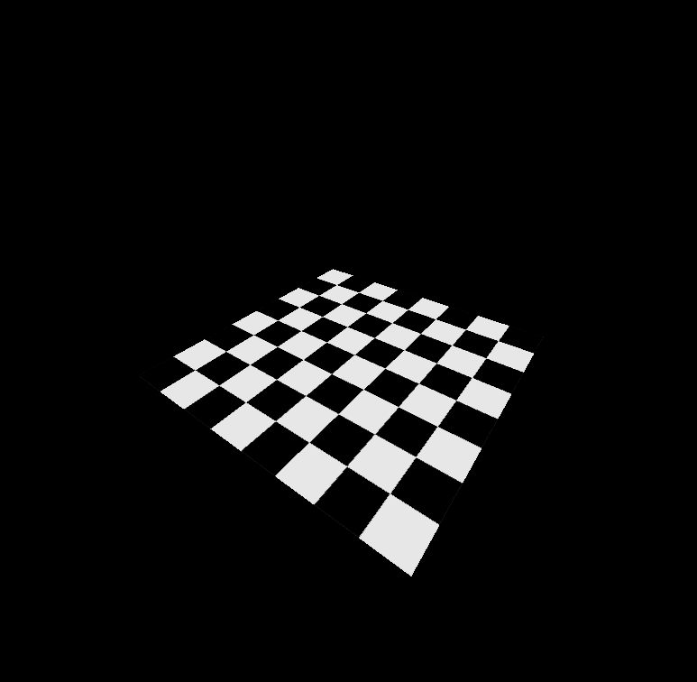
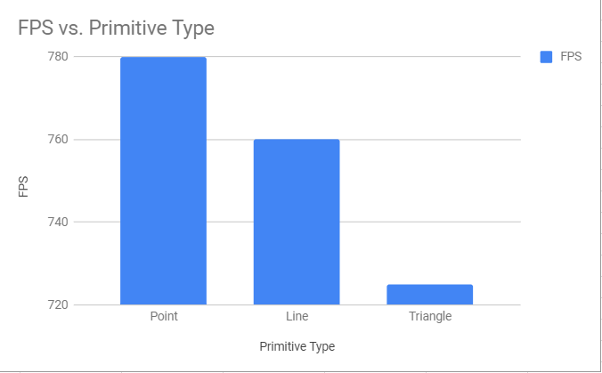
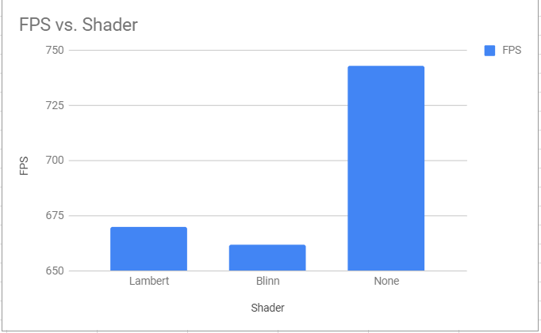
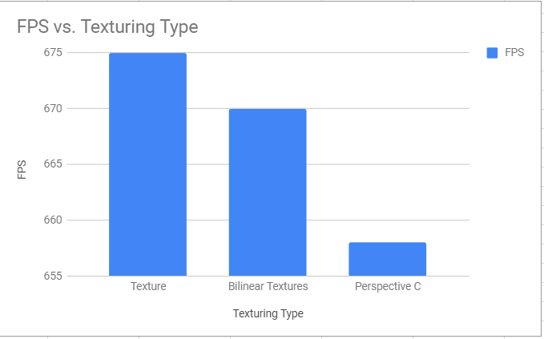
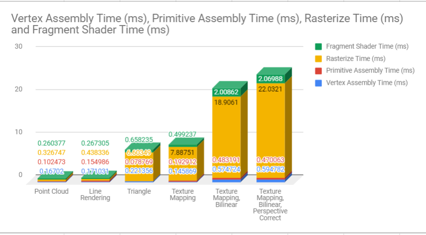

CUDA Rasterizer
===============

[CLICK ME FOR INSTRUCTION OF THIS PROJECT](./INSTRUCTION.md)

**University of Pennsylvania, CIS 565: GPU Programming and Architecture, Project 4**

* Emily Vo
  * [LinkedIn](linkedin.com/in/emilyvo), [personal website](emilyhvo.com)
* Tested on: Windows 10, i7-7700HQ @ 2.8GHz 16GB, GTX 1060 6GB (Personal Computer)
Updated the CMakeLists.txt to sm_61.

### Blinn

### Lambert

### README
This project is a rasterizer implemented in CUDA. A typical rasterization pipeline was implemented. First, the vertex attributes were computed and assembled (e.g. eye position, eye normal, texture coordinates, and texture properties). The primitives were also assembled. The primitives are then passed to the rasterization step, where the program can choose to rasterize triangles, points, or lines. The fragment's normal, eye points and UVs are determined through barycentric interpolation. The fragment color can be read from a texture in the rasterize step using the newly interpolated UVs. Finally, The fragments are passed to the render step, where two types of shaders are implemented - Blinn and Lambert. 

#### Features
##### Point Cloud 

To render a point cloud, I used the NDC x and y coordinates. I tested if they were in the bounds of the screen, and then simply colored the fragment with a normal.

##### Wireframe Rendering

For each line, I iterated over the x values from x-min to x-max and then solve for y in each iteration using the point-slope formula. If the x and y points are both in the screen, then I color the fragment with the normals.

##### Triangle Rendering

To render the triangle, I iterate over the bounding box of triangles, and test if the point is inside the triangle using barycentric coordinates. I color the fragment if it is in the bounds of the triangle.

##### Texture Mapping
For vanilla texture mapping, I simply converted the UVs to texture space and converted those values to indices within the flat texture array.

In general, reading from textures are slower because you can sometimes experience cache misses when attempting to fetch a texture value. When you have a cache miss, you end up wasting more cycles trying to search for the value in physical memory.

##### Bilinear Interpolation
Bilinear interpolation is a basic resampling technique. When reading from the texture, I sampled 4 texture coordinates that surround the uv coordinates. I then passed in the distance to these corner texture coordinates as the t-value to interpolation functions. In bilinear interpolation, you first interpolate across the x-direction at the upper bounds and lound bounds of the square domain you're interpolating. You then interpolate acros the y-direction using the two interpolated x-values to get one final scalar value. In general, you get smoother looking textures. 

Because you end up reading from a texture 4 times per fragment, you get a much more expensive computation. 

Source: https://blog.demofox.org/2015/04/30/bilinear-filtering-bilinear-interpolation/

##### Perspective Correct UVs

In the case of a checkerboard plane, it is easy to see that without perspective correct UVs, the appearance of the plane is extremely distorted.

With perspective correct UVs, the texture now appears correct with foreshortening.

#### Performance Analysis

This graph shows rendering triangles is most expensive, and rendering lines is less expensive, and rendering the points is the least expensive. It makes sense that it would be slower when you need to rasterize every pixel in the triangle for each frame, versus when you only need to shade a few points.

Flat shading is not expensive. Lambert is more expensive because lambert's coefficient must be computed every frame. Blinn is more expensive because lambert's law must be computed as well as the specular component, and their contributions are weighted in the final pixel color.

The first bar is vanilla texturing. The next is bilinear texturing, and the last is bilinear with perspective correct. Bilinear is expensive because you need to sample the texture 4 times per fragment, increasing the chances of a cache miss.

In this graph, each part of the pipeline is timed with different features. Throughout the graph, vertex and primitive assembly remains the same, except for when texture attributes need to be set. That explains why the vertex and primitive assembly slows down a little bit when textures are turned on. Rasterization varies the most between each feature. Rasterization experiences a huge slowdown when triangles are turned down, and another slowdown when texture mapping is turned down. Rasterization with bilinear becomes extremely slow, probably from the increased likelihood of cache misses. Fortunately, perspective correction is not as expensive to add on top of texturing and is a huge benefit to the appearance of the renders, since it is just a handful of additional mathematical operations.

### Credits

* [tinygltfloader](https://github.com/syoyo/tinygltfloader) by [@soyoyo](https://github.com/syoyo)
* [glTF Sample Models](https://github.com/KhronosGroup/glTF/blob/master/sampleModels/README.md)
