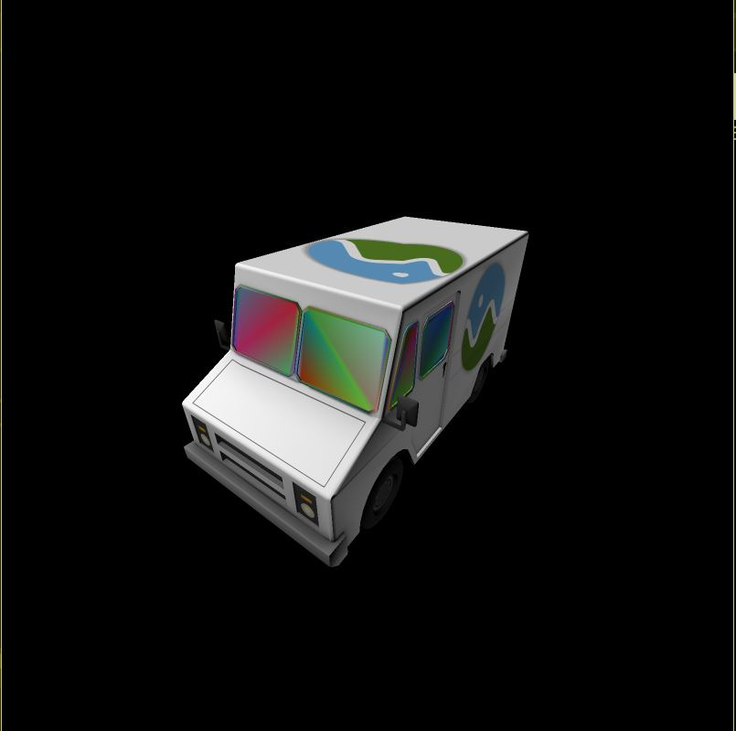
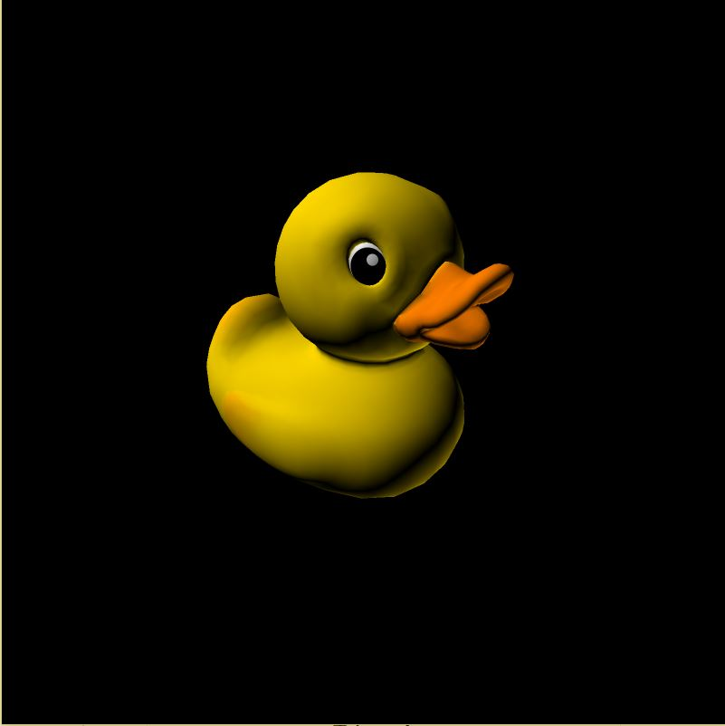
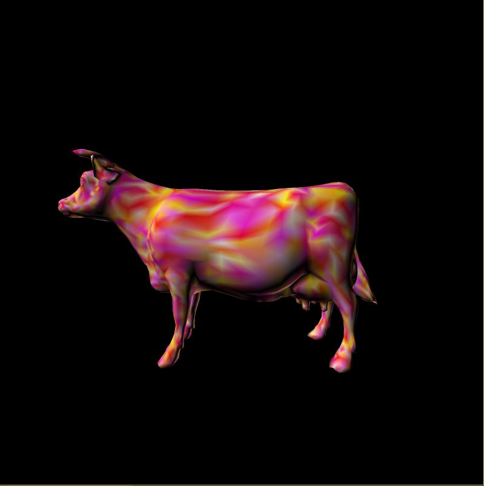
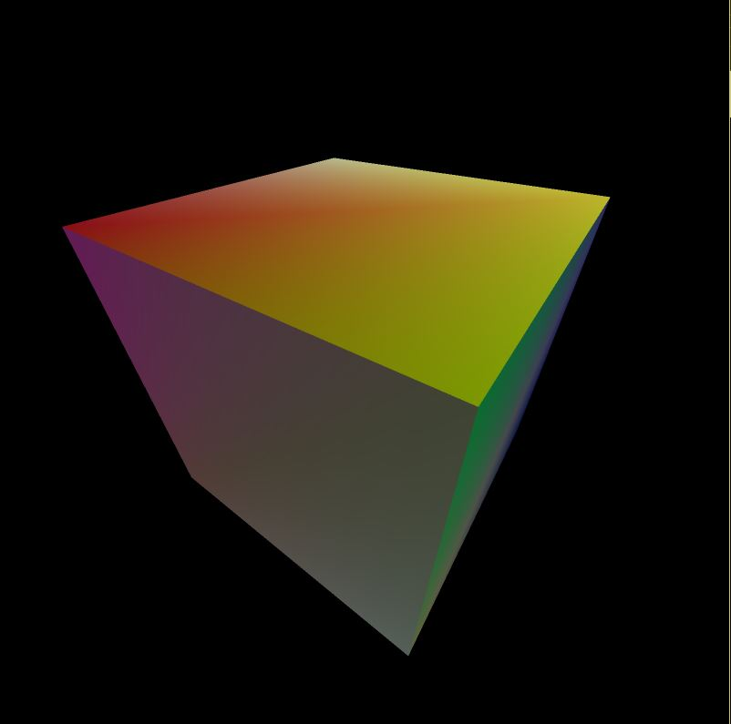
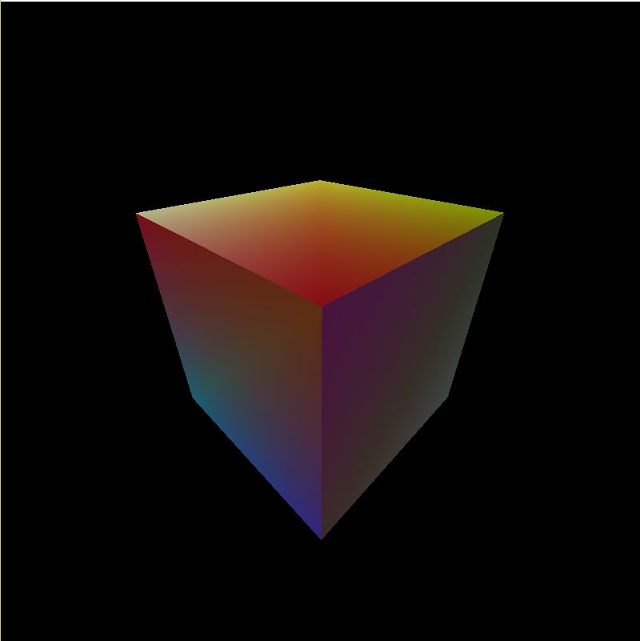
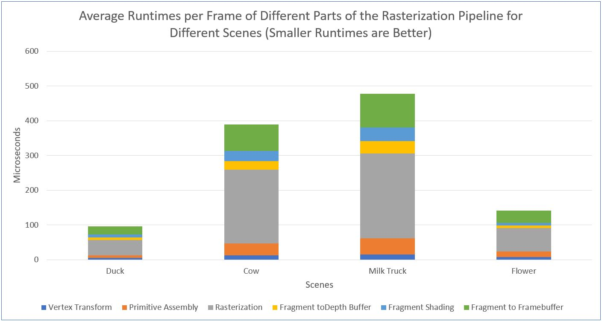
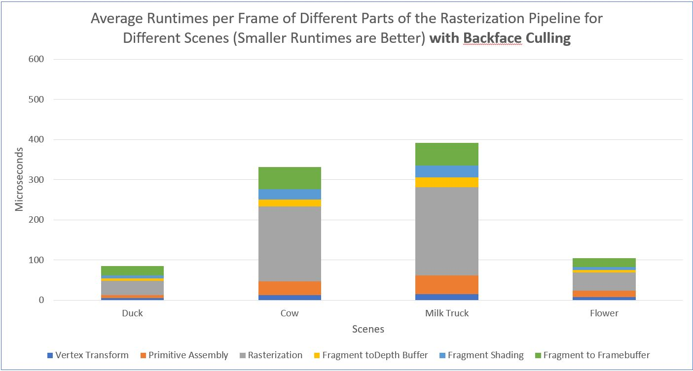

CUDA Rasterizer
===============

**University of Pennsylvania, CIS 565: GPU Programming and Architecture, Project 4**

* Ishan Ranade
* Tested on personal computer: Gigabyte Aero 14, Windows 10, i7-7700HQ, GTX 1060

## Demo

## Introduction

I implemented a GPU based rasterization pipeline with a number of added on features.  For a brief overview the rasterization pipeline consists of a number of steps including vertex transformation of a set of user defined vertices, primitive assembly to arrange these vertices into shapes, a fragment depth test in which the closest fragment is saved, fragment transformation to determine the final color of a pixel, and finally rendering to the screen.  Specific extra features that I chose to implement were super sampled antialiasing, UV texture mapping with bilinear texture filtering and perspective correct texture coordinates, correct color interpolation between points on a primitive, and backface culling.

## Features

- UV texture mapping with bilinear texture filtering and perspective correct texture coordinates

 

- Correct color interpolation between points on a primitive

 

- Super sampled anti aliasing

 

- No anti aliasing

 

## Performance Analysis

The rasterization step of the pipeline seemed to take the longest time, and this is because of the heavy computation in calculating which pixels overlap which triangles.  I implemented backface culling to try to reduce the computation time, and the graphs can be seen below comparing runtimes with and without this optimization.

Antialiasing also increased the runtime as the size of the PBO quadrupled in size so the computations became 4 times as expensive.  This step was necessary though because without it you can easily see jagged edges along diagonal lines as can be seen in the above images.

### Credits

* [tinygltfloader](https://github.com/syoyo/tinygltfloader) by [@soyoyo](https://github.com/syoyo)
* [glTF Sample Models](https://github.com/KhronosGroup/glTF/blob/master/sampleModels/README.md)
