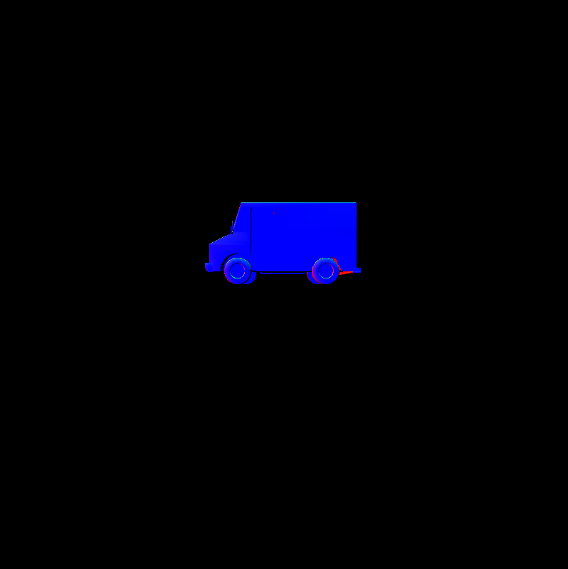

CUDA Rasterizer
===============

**University of Pennsylvania, CIS 565: GPU Programming and Architecture, Project 4**

Hannah Bollar: [LinkedIn](https://www.linkedin.com/in/hannah-bollar/), [Website](http://hannahbollar.com/)

Tested on: Windows 10 Pro, i7-6700HQ @ 2.60GHz 15.9GB, GTX 980M (Personal)

____________________________________________________________________________________

   

[//]: # ( 

[Visuals](#visuals) - [Features](#all-current-features) - [Optimizations](#optimizations) - [Bloopers](#bloopers) - [References](#references) 

# Rasterizer

### Visuals

Triangles | Normals | Lines | Points
:-------------------------:|:-------------------------:|:-------------------------:|:---------------------:
| | | |
| | | |
| | | 

`*` note that the cow had no texture nor a base color, so it's texture was rendered by normals based on my implementation.
`*` additionally my duck photo for points isnt showing up here atm, but it is in my images folder properly. still to figure out why markdown is doing this.

### All Current Features

The flags of all toggleable features can be updated in `rasterize.cu`.

Graphics Features
- Vertex Shading
- Primitive Assembly
	- Triangles
	- Lines*
	- Points*
- Rasterization
- Fragment Shading
	- Lambert
	- Regular Texture Mapping*
	- Bilinear Interpolated Texturing*
- Use of Depth Buffer for Frag Comparisons
	- Mutex to prevent race conditions
- BackFace Culling*

`*` = additional features.

### Optimizations

Here it's noticeable that the Primitive assembly is most often the costliest action. Having Back Face Culling and Mutex are the most beneficial optimizations, and adding in the overhead for bilinear interpolated texturing is extremely costly in comparison, even with the optimizations it is still slower than the runtime that doesnt have bilinear interpolation but also doesnt have any optimizations.

There's heavy overhead for my line vertex transforms and primitive assembly because I have a helper method there for readability and the others dont have this.

### Bloopers

Bad Back Face Culling | Improper Line Rasterizing | Overblown Bilinear Texturing
:-------------------------:|:-------------------------:|:-------------------------:
| | 

- bad back face culling - my directional check was reversed mistakenly
- improper line rasterizing blooper - I had clamped to an int to late, so my indexing was out of the appropriate bounds after I had already done my bounds check.
- overblown bilinear texturing - never properly casted to int, yielded same mathematical indexing error as improper line rasterizing blooper but visual was different because of differeing visualization scheme

### References

* [tinygltfloader](https://github.com/syoyo/tinygltfloader) by [@soyoyo](https://github.com/syoyo)
* [glTF Sample Models](https://github.com/KhronosGroup/glTF/blob/master/sampleModels/README.md)
* [bilinear filtering](https://en.wikipedia.org/wiki/Bilinear_filtering)
