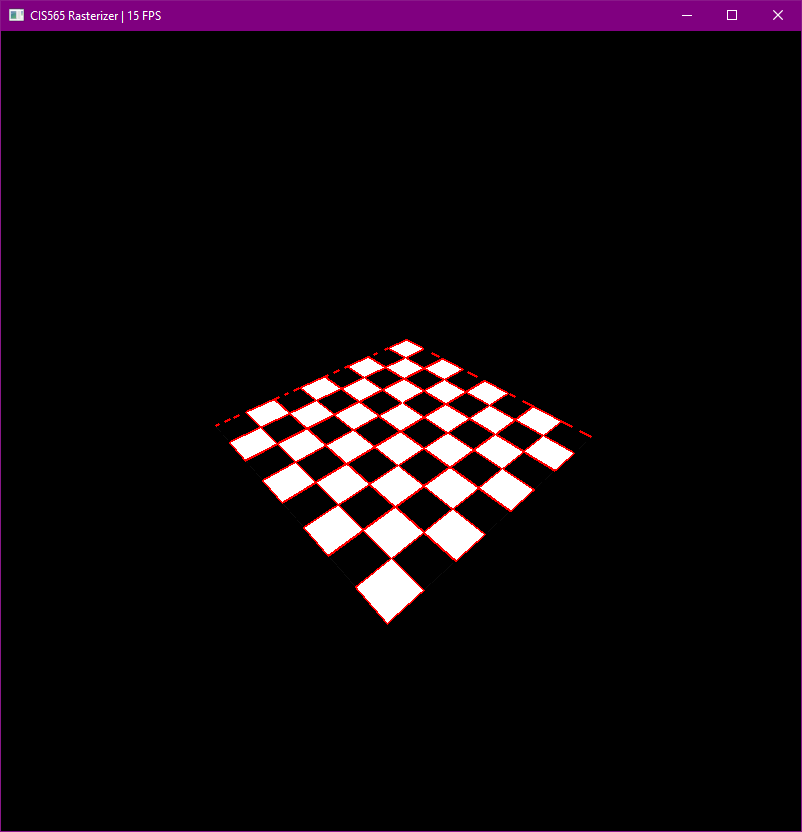

CUDA Rasterizer
===============

**University of Pennsylvania, CIS 565: GPU Programming and Architecture, Project 4**

* Alexander Chan
* Tested on: Windows 10 Version 1803, i7-5820k @ 3.70 GHz 16GB, GTX 1080 @ 1620 MHz 8GB (Personal Computer)

### Features
- Lambertian shading
- Perspective correct UV interpolation and textures

	

	

- FXAA

	FXAA is a fast screen space antialiasing method. It detects edges and blurs them.

	Step 1:

	Detect which pixels to apply antialiasing on.

	

	Step 2:

	Determine if the edge is oriented horizontal or vertical. Blue is vertical, yellow is horizontal.

	

	Step 3:

	Determine highest contrast pixel pair orthogonal to the edge. A pair consists of a blue and green pixel in the debug image.

	

	Step 4:

	Determine the length of the edge by traversing along the orientation of the edge.

	Step 5:

	Offset the pixel by its distance to the end of the edge. The closer it is to the edge, the more it is blurred.

### Credits

* [tinygltfloader](https://github.com/syoyo/tinygltfloader) by [@soyoyo](https://github.com/syoyo)
* [glTF Sample Models](https://github.com/KhronosGroup/glTF/blob/master/sampleModels/README.md)
