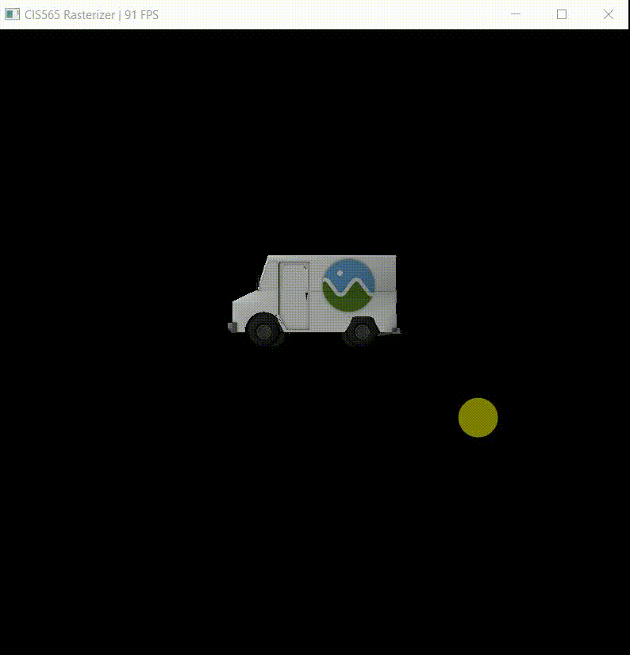
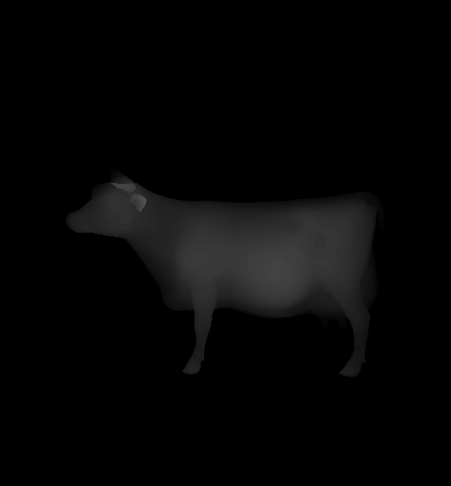
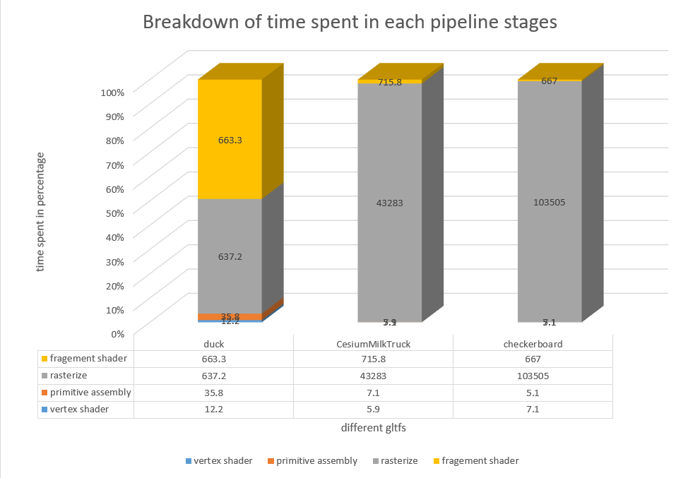

CUDA Rasterizer
===============

[CLICK ME FOR INSTRUCTION OF THIS PROJECT](./INSTRUCTION.md)

**University of Pennsylvania, CIS 565: GPU Programming and Architecture, Project 4**

* Yuru Wang
* Tested on: Windows 10, i7-7700HQ @ 2.5GHz 128GB, GTX 1050 Ti 8GB (personal computer)
* Modified CMakeList.txt: changed sm_20 to sm_61 inside cuda_add_library

## Project Description ##
This project implements a simplified rasterized graphics pipeline, similar to the OpenGL pipeline which includes vertex shading, primitive assembly, rasterization, fragment shading, and a framebuffer

A list of features implemented in this project is as follows:
* Vertex shading. (vertexTransformAndAssembly in rasterize.cu)
* Primitive assembly with support for triangles read from buffers of index and vertex data. (primitiveAssembly in rasterize.cu)
* Rasterization. (**support rasterization for points, lines and triangles**)
* A depth buffer for storing and depth testing fragments.
* Fragment-to-depth-buffer writing (Utilized CUDA atomicMin() for race avoidance).
* Fragment shader with Lambert shading and point light (render in rasterize.cu)
* **UV texture mapping with bilinear texture filtering and perspective correct texture coordinates**.

## Results ##
**Screen recording of running program with lambert shading and point light**
| duck.gltf | CesiumMilkTruck.gltf |
|------|------|
|  | |

**Render depth and normals**
| depth | normal |
|------|------|
|  |  |

**Texture mapping and lambert shading**
| plain color | lambert shading |
|------|------|
|  |  |

| plain color | lambert shading |
|------|------|
|  |  |

**Render texture w/o bilinear texture filtering**
| no bilinear filtering | with bilinear filtering |
|------|------|
|  |  |

**Back face culling**
| render front face | render back face |
|------|------|
|  |  |

**Render points and lines**
| render points | render lines |
|------|------|
|  |  |

## Performance Analysis and Questions ##

Above figure shows the time spent on different rendering pipeline stages for three models. The time is measured on the present of lambert shading, back face culling, and bilinear filtering. As expected, rasterization takes most amount of time in graphics pipeline because the rasterization is parallelized by primitives and each thread needs to iterate through all fragments inside the bounding box, which has a lot more work than other stages. For duck.gltf, the time spent on fragment shading is almost the same as rasterization, this is because in duck model, after rasterization, every fragment have different normals due to the curve surfaces, which results in different calculation time for lambert shading on each threads.

This figure is for the duck.gltf with lambert shading. We can observe an optimization on the performance of rasterization stage which is expected since back face culling eliminates primitives that are not visible by the camera and thus some threads or warps could exterminate quickly.

Above figure is obtained by rendering duck.gltf with back face culling and just texture mapping(no lambert shading). We can notice a little bit performance decay on the fragment shading stage if we add bilinear texture filtering. This is because with bilinear filtering, there are some more operations need to done for every fragment (literally 3 more linear color interpolations) which slow down the process a little bit.

### Credits

* [tinygltfloader](https://github.com/syoyo/tinygltfloader) by [@soyoyo](https://github.com/syoyo)
* [glTF Sample Models](https://github.com/KhronosGroup/glTF/blob/master/sampleModels/README.md)
