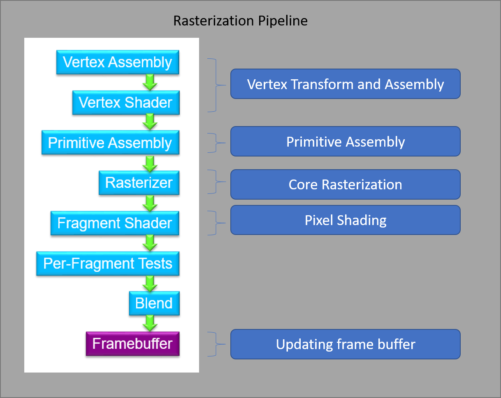
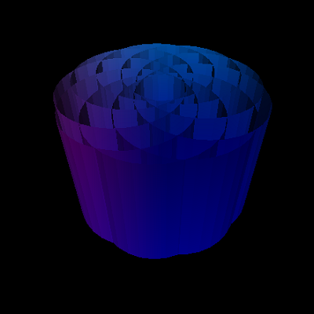
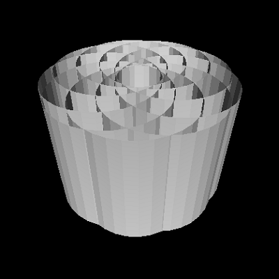
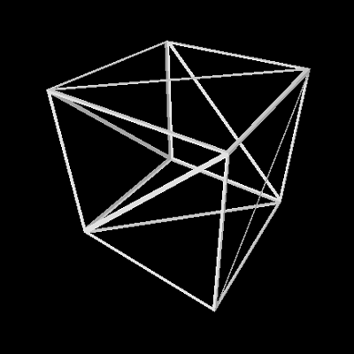

CUDA Rasterizer
===============

**University of Pennsylvania, CIS 565: GPU Programming and Architecture**

**Anantha Srinivas**
[LinkedIn](https://www.linkedin.com/in/anantha-srinivas-00198958/), [Twitter](https://twitter.com/an2tha)

**Tested on:**
* Windows 10, i7-8700 @ 3.20GHz 16GB, GTX 1080 8097MB (Personal)
* Built for Visual Studio 2017 using the v140 toolkit

# Introduction

 

# Features

The current version of the rasterizer supprots the following features:

* Vertex Shading and primitive assembly with depth testing

| Color  | Normal | Depth |
| ------------- | ------------- |  ------------- |
|  |   |  

* Instancing

* Texture Mapping (2D) with bilinear filtering

* SuperSample Antialiasing

| No SSAA |  SSAA 2 |
| ------------- | ------------- |
|  |   | 

* Color interpolation between points on a primitive

* Points and Lines

| Triangles  | Lines | Points |
| ------------- | ------------- |  ------------- |
|   |   |

# General Performance Analysis

# Build Command

`cmake .. -G "Visual Studio 15 2017 Win64" -DCUDA_TOOLKIT_ROOT_DIR="C:/Program Files/NVIDIA GPU Computing Toolkit/CUDA/v9.2" -T v140,cuda=9.2`

### Credits

* [tinygltfloader](https://github.com/syoyo/tinygltfloader) by [@soyoyo](https://github.com/syoyo)
* [glTF Sample Models](https://github.com/KhronosGroup/glTF/blob/master/sampleModels/README.md)
