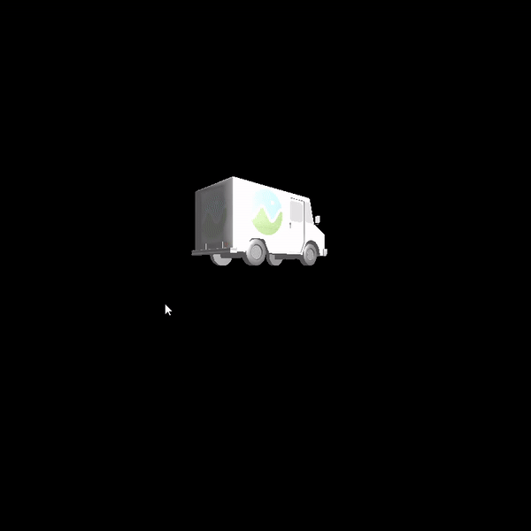

CUDA Rasterizer
===============

**University of Pennsylvania, CIS 565: GPU Programming and Architecture, Project 4**

* Yu Sun 
* [LinkedIn](https://www.linkedin.com/in/yusun3/)
* Tested on: Tested on: Windows 10 , i7-6700HQ CPU @ 2.60GHz × 8 , GeForce GTX 960M/PCIe/SSE2, 7.7GB Memory (Personal Laptop)

## Introduction
In this project, a basic rasterized graphic pipeline is implemented using cuda. The pipeline includes
vertex shading, primitive assembly, rasterization, fragment shading, and a framebuffer. The special features I implement 
for this project includes 

```
* Rasterization for lines and points
* Back-face culling
* UV texture mapping with bilinear texture filtering and perspective correct texture coordinates.
* Super-sample Anti-Aliasing 
```

Forgive my briefness for the README, I'll add more things if I get more time later.

***Rasterization for Points, Lines and Triangles*** 

Rasterization for points is straightforward by computing the corresponding pixel index and color. 

Rasterization for lines is approximated using the Bresenham Algorithm since a naive approach would lead to artifact 
coming from fixed grid resolution, and rounding float pixel locations to integer pixel locations

Rasterization for traingles is achieved by using barycentric coordinates 

Milk Car       | Duck | Flower
:-------------------------:|:-------------------------:|:-------------------------:
  |    |  

***Texture Mapping and Prospective Correction with Bilinear Interpolation***

The texture mapping can be achieved by using uv coordinates that warp 2D textures onto 3D mesh. Techniques used to make 
the texture look better include bilinear interpolation and perspective correction
using the depth information. 

A comparision of texture mapping with and without perspective correction is shown below.

Scene without Perspective Correction      | Scene with Perspective Correction
:-------------------------:|:-------------------------:
 |   

Bilinear interpolation is basically a techique used to prevent aliasing effect and make the resulting image
looks more natural and smooth by taking the color of surrounding pixels into account while generating the final
color for a specific pixel. Since the effect isn't that obvious, I picked one image that I found through Google Image
to demonstrate the effect.

 

***Back-face Culling***
Back-face culling is intended to reduce the amount of computation by eliminating the pixels that cannot be captured from 
the camera. However, while implementing it I found that I didn't see a significant speed up, and it actually creates some 
funny effect.

Scene without Back-face Culling     | Scene with Back-face Culling
:-------------------------:|:-------------------------:
  |   

The things that are culled out can be seen below

 

***Super-Sampled Antialiasing***
By super-sampling, one is essentially making more grids and creating higher resolution. This is a sacrifice on memory to 
give more details to the display. The difference can be seen below.

SSAA Factor = 1     | SSAA Factor= 4
:-------------------------:|:-------------------------:
  |   


## Performance Analysis 

Below is a graph demonstrating the amount of time spent on each stage of the graphics pipeline for different type of scenes.
Without much surprise, it can be seen that most time of the computation is spent on primitive rasterization. 

 

Notice how computation increase while we move closer to the rendered object due to the increase amount of checks we need to perform.

 
  


### Credits

* [tinygltfloader](https://github.com/syoyo/tinygltfloader) by [@soyoyo](https://github.com/syoyo)
* [glTF Sample Models](https://github.com/KhronosGroup/glTF/blob/master/sampleModels/README.md)
