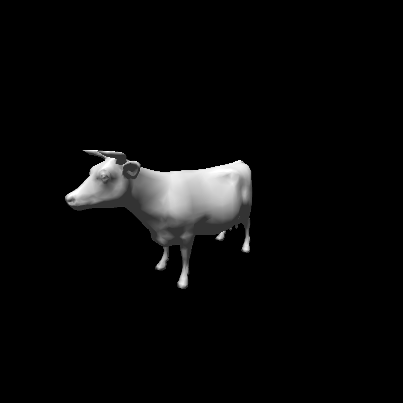

CUDA Rasterizer
===============

[CLICK ME FOR INSTRUCTION OF THIS PROJECT](./INSTRUCTION.md)

**University of Pennsylvania, CIS 565: GPU Programming and Architecture, Project 4**

* Wanru Zhao
  * [LinkedIn](www.linkedin.com/in/wanru-zhao).
* Tested on: Windows 10, Intel(R) Core(TM) i7-8750H CPU@2.2GHz, GTX 1070 with Max-Q Design(Personal Laptop)

### Final

  

### Features
#### Basic Features
- Vertex shading
- Primitive assembly with different primitive modes
- Rasterization
- A depth buffer for storing and depth testing fragments
- Fragment-to-depth-buffer writing (with atomics for race avoidance)
- Fragment shading (lambert and blinn-phong)
#### Extra Features
- Backface culling
- Correct color interpolation between points on a primitive
- UV texture mapping with bilinear texture filtering and perspective correct texture coordinates
- Support for rasterizing additional primitives: lines and points

### Results
#### Base pipeline
Albedo | Depth | Normal
:--:|:--:|:--:
 |  | 
Albedo | Lambert | Blinn-phong
 |  | 

#### Correct color interpolation
Without color correction | With color correction
:--:|:--:
 |  

#### UV texture mapping with bilinear texture filtering and perspective correct texture coordinates
Original | Perspective correct texture coordinates | Bilinear filtering + Perspective correct texture coordinates
:--:|:--:|:--:
 |  | 

#### Additional primitives
Triangle | Points | Lines
:--:|:--:|:--:
 |  | 

#### Backface culling
Original | Lines | Lines with backface culling
:--:|:--:|:--:
 |  | 

### Performance Analysis
#### Breakdown of time spent in each pipeline stage

  

Above chart shows that the majority of time spent in rendering pipeline is the stage "Rasterize", where primitives are scaned, overlapped fragments are calculated/stored, and depth test is done to decide the final fragment to be rendered. To avoid race condition, Atomic is used, which takes a considerate amount of time. Generally, more vertices/primitives a model has, more time will be taken for rasterization. (Cow vs Duck) Also the time spent in Rasterize is also related to the size of primitives of a model, since scanline does the calculation for every pixel in AABB of a primitive. (CesiumMilkTruck vs Duck).

For vertex shader and vertex assembly stages, the time spent is simply related to the number of vertices in a model. However, those two stages are very quick and have no significant influence to total process time.

Fragment shader is related to texturing and coloring, and there are only slight different among all models.

#### Performance of backface culling

  

Since backface culling ignores all backfaces, it benefits "Rasterize" stage the most and has little effect on other stages.

### Credits

* [tinygltfloader](https://github.com/syoyo/tinygltfloader) by [@soyoyo](https://github.com/syoyo)
* [glTF Sample Models](https://github.com/KhronosGroup/glTF/blob/master/sampleModels/README.md)
* Image save function transplanted from Project 3
