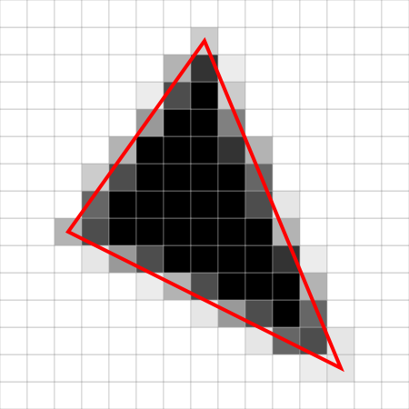

CUDA Rasterizer
===============

**University of Pennsylvania, CIS 565: GPU Programming and Architecture, Project 4**

* Jie Meng
  * [LinkedIn](https://www.linkedin.com/in/jie-meng/), [YouTube](https://www.youtube.com/channel/UC7G8fUcQrrI_1YnXY5sQM6A).
* Tested on: Windows 10, i7-7700HQ @ 2.80GHz, 16GB, GTX 1050 4GB (Personal Laptop)

Demo renders
================

Rasterization
==================
_Rasterization_ [[wiki](https://en.wikipedia.org/wiki/Rasterisation) is a render method in computer graphics, in essence, the process of showing 3D scenes containing objects are:

 - Project 3d objects into 2D camera plane
 - Given the 2D plane (with fixed resolution) and the projections of 3D shapes, fill the pixels that are inside those projected shapes.

 The process can be visualized as the following images:

Project | Fill pixels
------------|---------------
 | 

With the power of GPU and CUDA, we could achieve great performance by multi-threading.

Features
==================

### Graphics Features
#### Basic rasterization pipeline: Vertex transformation, Primitive Assembly, Rasterization, Fragment shading

 - Multiple Primitive types: Triangles, Wire frame, Points

 wire frame | points
------------|---------------
 | 

* The way I did multiple primitive types is a simple way: instead of creating new **PrimitiveAssembly** kernels, I still treat primitives as triangles, but only **fill** the pixels on **edges** or **vertices**

#### UV texture mapping with bilinear texture filtering and perspective correct texture coordinates

No bilinear filtering | Bilinear filtering
-------------------------- | ----------------------------
 | 

* Bilinear texture mapping [[wiki](https://en.wikipedia.org/wiki/Bilinear_filtering) is a way to avoid distortion when doing texture mapping. Given a uv coordinate, we use the nearest four texels to interpolate its color value.

#### Automatic Rotation: a dumb way to use shared memory to store a uniform rotation matrix for all vertices, such that the model is rotating by itself.

#### Post-processing: implemented bloom effect

 Without bloom | With bloom
------------|---------------
 | 

 * bloom effect [[wiki](https://en.wikipedia.org/wiki/Bloom_(shader_effect)) is a widely-used post processing method to present high-brightness areas. Shared memory is used to store pixel values that a block needed for perform gaussian blur.

### GUI controls
- Number keys to switch primitive types: triangles(1) / wireframe(2) / points(3)
- Key B to turn on/off bloom effect

### Macros
- `#define TEXTURE 1/0` : turn on(1)/off(0) to use diffuse texture
- `#define PERSPECTIVE_INTERP 1/0` : turn on(1)/off(0) to perform perspective correct interpolation
- `#define TEXTURE_BILINEAR 1/0` : turn on(1)/off(0) to use bilinear UV coordinates interpolation
- `#define DOWNSCALERATIO 3/(1-10)` : change down scale ration in gaussian blur, can be any reasonable integer (1-10 recommended)

Analysis
=================

### Basic render pipeline

* Configuration: x64 Release mode, no bilinear texture, no bloom effect

#### Absolute running time

From the chart: 
- reastrization kernel and render kernel consumes the most part of running time
- Initialize depth is basically one instruction per thread, so its running time can be viewed as a baseline
- Vertex assembly is looping over vertices, so essentially less threads are launched comparing to depth initialization, resulting less running time. 
- Send image to PBO stage is the same for both models, so the time spent is roughly the same
- Since Cow has more primitives than duck model, its primitive assembly, rasterization and render stage all take relatively more time

#### Running time percentages

The above chart shows the percentages of each stage's running time w.r.t. whole pipeline.
- Not supurisingly, rasterization takes the most time
- For small model like duck and cow, rasterization only takes a bit more time that render stage
- For relatively more complex model like truck, rasterization stage can comsume most time of the entire pipeline

#### Bloom effect

In practice, it turns out that bloom effect has almost no effect on performances: no FPS dropping is happening. I believe it because bloom effect (or generally, post-processing) is performed simply on framebuffers, which should not take much time.

### Credits

* [tinygltfloader](https://github.com/syoyo/tinygltfloader) by [@soyoyo](https://github.com/syoyo)
* [glTF Sample Models](https://github.com/KhronosGroup/glTF/blob/master/sampleModels/README.md)
