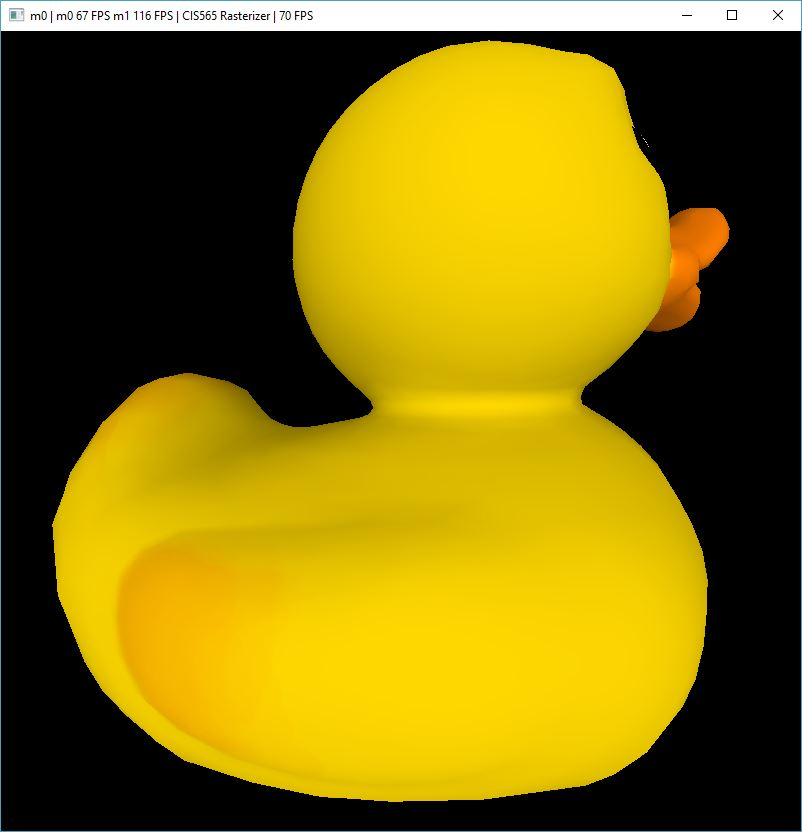
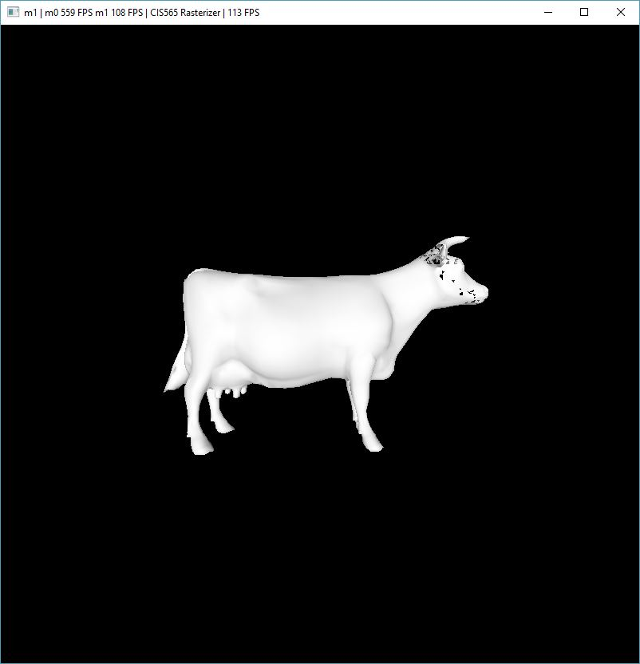

CUDA Rasterizer
===============

**University of Pennsylvania, CIS 565: GPU Programming and Architecture, Project 4**

* Xiao Zhang
  * [LinkedIn](https://www.linkedin.com/in/xiao-zhang-674bb8148/)
* Tested on: Windows 10, i7-7700K @ 4.20GHz 16.0GB, GTX 1080 15.96GB (my own PC)

Analysis 
======================
* blocksize1d is set to 128 unchanged

* image order is direct light integrator, full light integrator and naive integrator

* rendering time is measured in second

---

## 1. Checkerboard Scene 

### overview

### rendering time

### analysis

xxx.

### images

* checkerboard far distance
  

* checkerboard mid distance
  

* checkerboard near distance
  

---

## 2. Box Scene 

### overview

### rendering time

### analysis

xxx.

### images

* box far distance
  

* box mid distance
  

* box near distance
  

---

## 3. Flower Scene 

### overview

### rendering time

### analysis

xxx.

### images

* flower far distance
  

* flower mid distance
  

* flower near distance
  

---

## 4. Duck Scene 

### overview

### rendering time

### analysis

xxx.

### images

* duck far distance scan line
  

* duck far distance tile based
  

* duck mid distance scan line
  

* duck mid distance tile based
  

* duck near distance scan line
  

* duck near distance tile based
  

---

## 5. Cow Scene 

### overview

### rendering time

### analysis

xxx.

### images

* cow far distance scan line
  

* cow far distance tile based
  

* cow mid distance scan line
  

* cow mid distance tile based
  

* cow near distance scan line
  

* cow near distance tile based
  

---

## 6. Summary

* xxx. 

---

### Credits

* [tinygltfloader](https://github.com/syoyo/tinygltfloader) by [@soyoyo](https://github.com/syoyo)
* [glTF Sample Models](https://github.com/KhronosGroup/glTF/blob/master/sampleModels/README.md)
