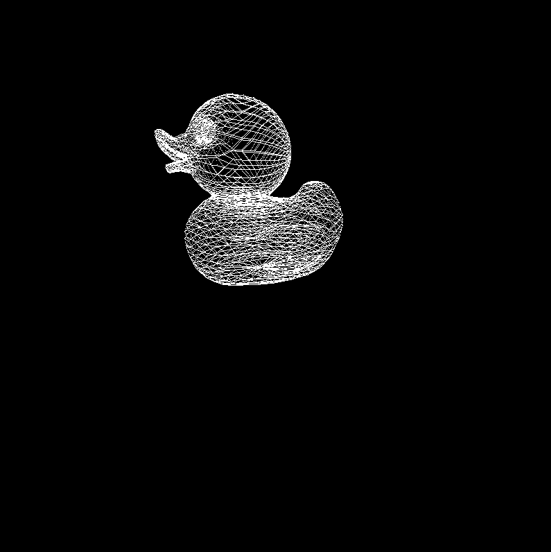

CUDA Rasterizer
===============

[CLICK ME FOR INSTRUCTION OF THIS PROJECT](./INSTRUCTION.md)

**University of Pennsylvania, CIS 565: GPU Programming and Architecture, Project 4**

* Eric Chiu
* Tested on: Windows 10 Education, Intel(R) Xeon(R) CPU E5-1630 v4 @ 3.60GHz 32GB, NVIDIA GeForce GTX 1070 (SIGLAB)

## Description

This project implements a rasterized graphics pipeline using CUDA programming and GPU hardware. Features include lambertian shading, UV texture mapping, and point and line rasterization.

## Performance Analysis

The following charts show a time breakdown for rasterizing the duck and truck model with various settings: point rasterization, line rasterization, triangle rasterization, and triangle rasterization with perspective correct UV mapping and bilinear texture filtering. We can see that the primitive assembly and vertex shading stages are same throughout the various settings, and the majority of the pipline is spent in the rasterization and fragment shader stages. This is probably because there are more fragments and triangles than vertices that the computer has to process. Another observation is that for the truck, the rasterization stage takes significantly longer with triangle rasterization. A possbile explanation is that the truck model covers many more pixels on the screen than the duck model, so our rasterizer has to iterate through more pixels.

## UV Texture Mapping

When UV texture mapping with barycentric coordinates, without the consideration of depth information and perspective correctness, bending artifacts start to appear on the object as shown below.

By taking into consideration of depth information from interpolated positions of triangles, the texture coordinates become perspective transformed, as shown below.

We can further improve UV texture mapping by anti-aliasing using a method called bilinear filtering. The idea of bilinear filtering is that instead of sampling a texture at a single point, we interpolate the color values of the four pixels around the selected point. This will remove jagged texture edges as shown below. 

## Point and Line Rasterization

Another feature of this rasterizer is point cloud and wireframe display. This can be achieved by adding a primitive type flag and modifying the rasterization stage, so that it processes vertex information differently depending on the primitive type. 

